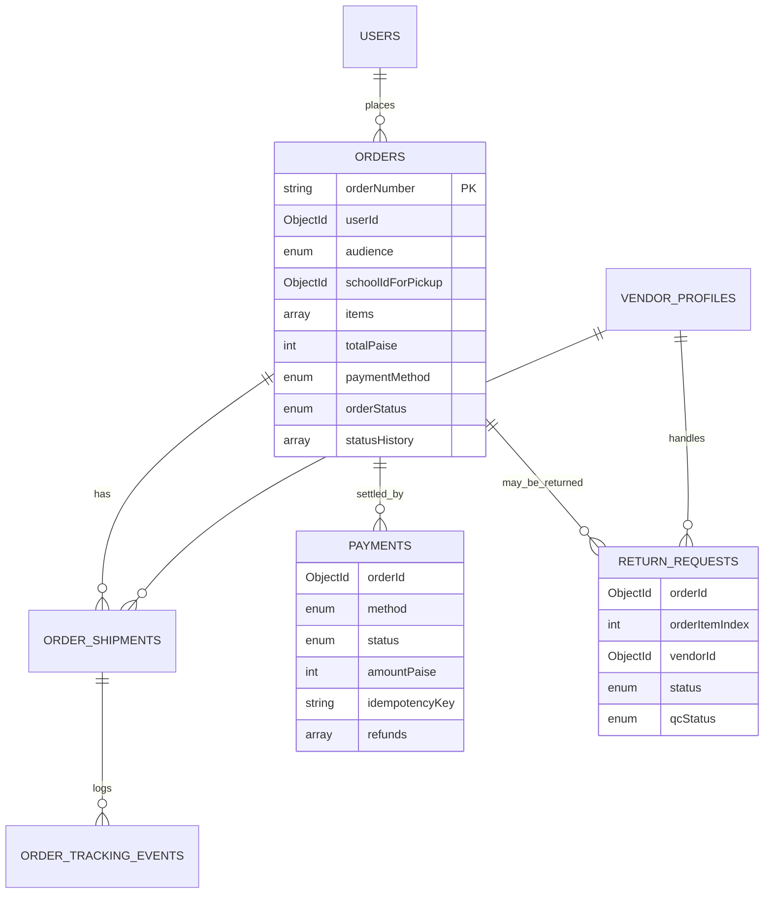
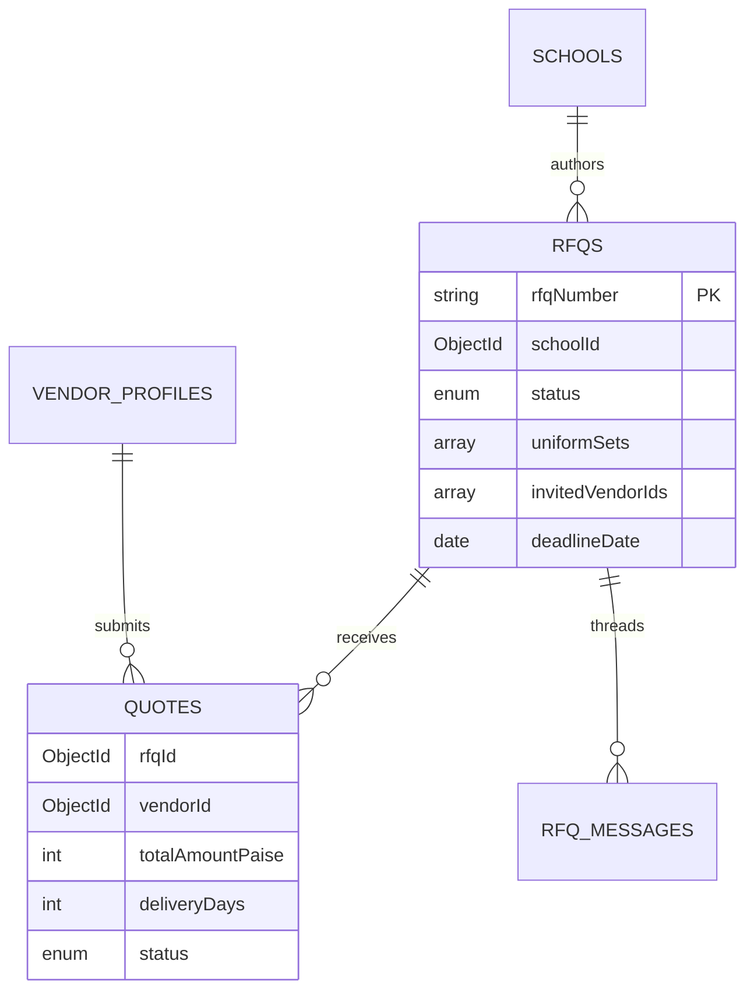

# School E-Mart — MongoDB Database Architecture

> **Source of truth:** `BACKEND_REQUIREMENTS.md` (this file is derived strictly from that BRS).
> **Database:** MongoDB 7.x (replica set recommended). Document model. JSON-Schema validators on every collection.
> **Scope:** Production-ready architecture, indexing, validation, multi-tenancy, scalability and risk analysis. **No Mongoose schemas / no implementation code.**
> **Conventions:**
> - All `_id` fields are `ObjectId` unless explicitly stated otherwise.
> - All references use `ObjectId`. Human-readable IDs (`SEM-P-…`, `ORD…`, `REQ-YYYY-NN`) are stored as separate string fields named `refId` / `code` / `orderNumber`.
> - All timestamps are stored as UTC `Date` (ISODate).
> - Money stored in **integer paise** (₹1 = 100 paise) to avoid float drift; UI multiplies/divides as needed.

---

## 1. Collection Inventory

Legend — **Volume:** L (low, <10⁴ docs), M (medium, 10⁴–10⁶), H (high, >10⁶).
**Ownership:** *global* (platform-wide), *tenant* (scoped to one school), *user* (per-user-scoped), *vendor* (per-vendor-scoped).

### 1.1 Identity, Auth, Profiles
| # | Collection | Purpose | Ownership | Volume |
|---|---|---|---|---|
| 1 | `users` | Single canonical identity for every login (parent / school admin / teacher / vendor / admin). Holds credentials, role, status, refId. | global | M |
| 2 | `parentProfiles` | Parent-specific extended data: photo, address book pointer, active child. | user | M |
| 3 | `schoolStaffProfiles` | School-admin-specific extended data (designation, phone, school link). | user / tenant | L |
| 4 | `teacherProfiles` | Teacher extended profile (designation, qualification, joiningDate, employeeId). | user / tenant | M |
| 5 | `vendorProfiles` | Vendor extended profile (storeName, geo, serviceRadius, bank, tax). | vendor | L–M |
| 6 | `adminProfiles` | Super admin profile (firstName, lastName, mobile). | global | L |
| 7 | `addresses` | Multiple delivery addresses per user (home / school pickup / billing). | user | M |
| 8 | `childProfiles` | Child sub-profiles owned by a parent (one or many — see assumption A1). | user | M |
| 9 | `otpRequests` | OTP issuance and verification audit. **TTL-cleaned** after expiry+grace. | global | H (rolling) |
| 10 | `authSessions` | Issued JWT/refresh-token tracking, device fingerprint, last-seen. **TTL** on expiry. | user | H (rolling) |
| 11 | `passwordResets` | Reset tokens for `/auth/forgot-password`. **TTL**. | user | M (rolling) |

### 1.2 Organization (Schools)
| # | Collection | Purpose | Ownership | Volume |
|---|---|---|---|---|
| 12 | `schools` | Master record of every school onboarded (name, code, address, refNo, partner status). | global | L |
| 13 | `schoolMemberships` | Maps users → schools with role+status (e.g., teacher pending/approved, admin owner). Source of school-tenant linkage. | tenant | M |

### 1.3 Catalog
| # | Collection | Purpose | Ownership | Volume |
|---|---|---|---|---|
| 14 | `headerCategories` | Top-level navigation headers (All, Ashlay…) with commission/fees. | global | L |
| 15 | `categories` | Logical product groupings under a header. | global | L |
| 16 | `subcategories` | Leaf catalog nodes. | global | L–M |
| 17 | `products` | Vendor products with approval workflow, stock, price, variants, images. | vendor / global | M–H |
| 18 | `productVariants` | (Optional) Variant breakouts when product has many SKUs. See assumption A2. | vendor | M |
| 19 | `productReviews` | Implied by the UI's "rating / reviews" badge on product detail. | user | M |
| 20 | `kits` | Curated bundles (school-specific or platform-curated) with selectable items + add-ons. | tenant / global | L–M |

### 1.4 Students & Academics (tenant-scoped to a school)
| # | Collection | Purpose | Ownership | Volume |
|---|---|---|---|---|
| 21 | `students` | Authoritative student record (class, section, roll, admission no, parent linkage). | tenant | M |
| 22 | `attendanceRecords` | One row per student per date with status (P/A/L/Late). | tenant | H |
| 23 | `homeworkAssignments` | Teacher-authored assignments at class+section level. | tenant | M |
| 24 | `homeworkSubmissions` | Per-student submission of an assignment + attachments. | user | M |
| 25 | `diaryEntries` | Teacher-to-parent communication (class or selected students). | tenant | M |
| 26 | `notices` | School-wide / class-wide / audience-targeted notices from school admin. | tenant | M |
| 27 | `events` | School calendar events. | tenant | M |
| 28 | `leaveApplications` | Parent-submitted leave requests for a child. | tenant | M |
| 29 | `phonebookEntries` | School-staff contacts visible to parents. | tenant | L |

### 1.5 Commerce
| # | Collection | Purpose | Ownership | Volume |
|---|---|---|---|---|
| 30 | `carts` | Server-side cart per user. Single active cart per (user, audience). | user | M |
| 31 | `wishlists` | Wishlist per user. | user | M |
| 32 | `orders` | Order header with items embedded for atomic creation; parent + school orders share this collection. | user / tenant | H |
| 33 | `orderShipments` | Shipment-level tracking (multi-vendor orders may have several shipments). | user | H |
| 34 | `orderTrackingEvents` | Time-ordered status/location events appended to a shipment. | user | H |
| 35 | `payments` | Payment intent / transaction record per order (online + COD). | user | H |
| 36 | `returnRequests` | Customer-initiated returns; vendor manages lifecycle. | user / vendor | M |

### 1.6 Procurement / RFQ
| # | Collection | Purpose | Ownership | Volume |
|---|---|---|---|---|
| 37 | `rfqs` | School Uniform/Procurement Request — both drafts and published. Embeds `uniformSets[]`, `invitedVendorIds[]`, `quotationRequirements[]`. | tenant | M |
| 38 | `quotes` | Vendor quote against an RFQ. | vendor | M |
| 39 | `rfqMessages` | Threaded messages between school and an invited vendor on an RFQ. | tenant + vendor | M |

### 1.7 Wallet / Financial
| # | Collection | Purpose | Ownership | Volume |
|---|---|---|---|---|
| 40 | `wallets` | Balance pointer per user (parent, school, vendor). | user | M |
| 41 | `walletTransactions` | Immutable double-entry-style ledger lines for credits/debits. | user | H |
| 42 | `payoutRequests` | Vendor withdrawal requests (super admin approves). | vendor | M |
| 43 | `withdrawals` | Approved withdrawals with banking ref. **(May be merged with payoutRequests — see A3)** | vendor / global | M |
| 44 | `vendorLedger` | Aggregated daily vendor sales / commissions for fast reporting. **Materialized.** | vendor | M |
| 45 | `billingConfig` | Singleton: platform fee, free-delivery threshold, distance pricing tiers. | global | L |

### 1.8 Engagement / Media
| # | Collection | Purpose | Ownership | Volume |
|---|---|---|---|---|
| 46 | `notifications` | Per-user / broadcast notifications (order, school, seller, admin). | user / global | H |
| 47 | `notificationCampaigns` | Super-admin-authored broadcast metadata (target audience, schedule). | global | M |
| 48 | `referrals` | Referral code, totals, monthly counters per user. | user | M |
| 49 | `referralInvitees` | Conversion attribution (referrer → invitee → status). | user | M |
| 50 | `reels` | Short-video posts (admin / vendor authored). | global | M |
| 51 | `reelInteractions` | Per-(user, reel) like / save / share state. | user | H |
| 52 | `reelComments` | Comments on reels. | user | H |
| 53 | `lmsCourses` | LMS lesson catalog. | global | M |
| 54 | `lmsLessonProgress` | Per-user progress and last position for a lesson. | user | H |

### 1.9 CMS / Content / Lookups
| # | Collection | Purpose | Ownership | Volume |
|---|---|---|---|---|
| 55 | `cmsPages` | About / Terms / Privacy / Refund / How-it-works / How-it-works school FAQ rich content. | global | L |
| 56 | `faqs` | Help-Center FAQs (admin-managed). | global | L |
| 57 | `promoBanners` | Home banners (image, target URL, category, orderRank). | global | L |
| 58 | `promoHomeSections` | Configurable home-page product carousels. | global | L |
| 59 | `vendorAnnouncements` | Platform → vendor announcements (vendor dashboard). | global | L |
| 60 | `seoMetadata` | Per-page SEO (title, description, JSON-LD). | global | L |
| 61 | `landingContent` | Hero / testimonials / case studies / video sections. | global | L |
| 62 | `lookupGrades`, `lookupSections`, `lookupSubjects`, `lookupAcademicYears`, `lookupEventTypes`, `lookupEventCategories`, `lookupHomeworkTypes`, `lookupCitiesPincodes` | Reference data. (Could collapse into a single `lookups` collection with a `type` discriminator — see assumption A4.) | global | L |

### 1.10 Support, Leads, System
| # | Collection | Purpose | Ownership | Volume |
|---|---|---|---|---|
| 63 | `vendorLeads` | Public "Sell with Us" applications. | global | M |
| 64 | `supportMessages` | "Contact Us" inbound messages (parent + school). | global | M |
| 65 | `supportAccountManagers` | Account manager modal data. | global | L |
| 66 | `supportTopics` | Vendor Help & Support topics. | global | L |
| 67 | `attachments` | Generic file metadata for any upload (images, video, docs) — pointer to S3 / GCS key. | global | H |
| 68 | `auditLogs` | Append-only admin/audit trail. | global | H |
| 69 | `outboxEvents` | Transactional outbox for fan-out (notifications, email, SMS, push, search indexing). | global | H (rolling) |
| 70 | `idempotencyKeys` | Dedup table for unsafe POSTs (orders, payouts). **TTL.** | global | M (rolling) |
| 71 | `rateLimits` | Per-IP / per-user rate-limit counters (OTP, leads, contact). Optional: keep in Redis instead. | global | H (rolling) |

> **Total: 71 collections.** This is the maximum-decomposed design. Sections 8 and 12 list opportunities to merge low-volume collections (e.g., lookups) if simpler operations are preferred.

---

## 2. Detailed Collection Schemas

Convention used per field: **(type)** `required` | `optional`, default, enum, refs, constraints. Example documents follow each schema.

### 2.1 `users`
Unified identity table. All sign-up flows write here first.

| Field | Type | Req | Default | Enum / Notes |
|---|---|---|---|---|
| `_id` | ObjectId | Y | auto | |
| `refId` | String | Y | generated | `^SEM-(P|ADM|TCH|VEN|SADM)-[A-Z0-9]{4,8}$` |
| `role` | String | Y | — | `parent` \| `school` \| `teacher` \| `vendor` \| `admin` |
| `status` | String | Y | `active` | `active` \| `pending_approval` \| `suspended` \| `inactive` |
| `name` | String | Y | — | 1–80 chars |
| `email` | String | N | null | RFC-822 (regex `\S+@\S+\.\S+`). **Unique sparse.** |
| `phone` | String | Y | — | 10 numeric digits, normalised. **Unique sparse.** |
| `passwordHash` | String | N | null | bcrypt/argon2. Null for parent (OTP-only). |
| `passwordAlgo` | String | N | `argon2id` | `argon2id` \| `bcrypt` |
| `emailVerifiedAt` | Date | N | null | |
| `phoneVerifiedAt` | Date | N | null | Set when OTP succeeds |
| `lastLoginAt` | Date | N | null | |
| `loginCount` | Int | Y | 0 | |
| `mfaEnabled` | Boolean | Y | false | Reserved for admin in future |
| `roleScopes` | Array<String> | N | [] | Fine-grained admin scopes |
| `tenantSchoolId` | ObjectId → `schools` | N | null | Required if `role ∈ {school, teacher}` |
| `defaultLocale` | String | Y | `en-IN` | |
| `audit` (see §7) | Object | Y | — | createdAt, updatedAt, createdBy, updatedBy, version |
| `softDelete` (see §6) | Object | Y | — | isDeleted=false |

Example:
```jsonc
{
  "_id": "ObjectId('66e0…')",
  "refId": "SEM-VEN-9F3K",
  "role": "vendor",
  "status": "pending_approval",
  "name": "Ankit Jain",
  "email": "ankit@hubs.in",
  "phone": "9876543210",
  "passwordHash": "$argon2id$…",
  "tenantSchoolId": null,
  "audit": { "createdAt": "2026-06-15T07:00:00Z", "updatedAt": "2026-06-15T07:00:00Z", "createdBy": "self", "version": 1 },
  "softDelete": { "isDeleted": false }
}
```

### 2.2 `parentProfiles`
1-to-1 with a `users` row of role=`parent`.

| Field | Type | Req | Notes |
|---|---|---|---|
| `userId` | ObjectId → `users` | Y | **Unique** |
| `avatarUrl` | String | N | Resolved S3 URL |
| `altPhone` | String | N | 10 digits |
| `addressBookIds` | Array<ObjectId → `addresses`> | N | |
| `defaultAddressId` | ObjectId → `addresses` | N | |
| `activeChildId` | ObjectId → `childProfiles` | N | |
| `gstin` | String | N | Optional GSTIN on checkout |
| `referralCode` | String | Y | `EMART\d{4}`, **unique** |
| `audit`, `softDelete` | | Y | |

### 2.3 `schoolStaffProfiles`
1-to-1 with users of role=`school`.

| Field | Type | Req | Notes |
|---|---|---|---|
| `userId` | ObjectId | Y | Unique |
| `schoolId` | ObjectId → `schools` | Y | The school this admin manages |
| `designation` | String | N | Principal / Admin / Coordinator |
| `avatarUrl` | String | N | |
| `altPhone` | String | N | |
| `permissions` | Array<String> | N | `students.write`, `notices.send`, … |
| `audit`, `softDelete` | | Y | |

### 2.4 `teacherProfiles`
| Field | Type | Req | Notes |
|---|---|---|---|
| `userId` | ObjectId | Y | Unique |
| `schoolId` | ObjectId → `schools` | Y | |
| `employeeId` | String | N | Unique per school |
| `designation` | String | N | |
| `department` | String | N | |
| `qualification` | String | N | |
| `experienceYears` | Int | N | ≥ 0 |
| `joiningDate` | Date | N | |
| `dob` | Date | N | |
| `gender` | Enum | N | `male`\|`female`\|`other`\|`unspecified` |
| `maritalStatus` | Enum | N | `single`\|`married`\|`other` |
| `subjectsTaught` | Array<String> | N | |
| `classAssignments` | Array<{ class, section }> | N | Which classes this teacher manages |
| `avatarUrl` | String | N | |
| `approvalStatus` | Enum | Y | `pending`\|`approved`\|`rejected` (default `pending`) |
| `approvedBy` | ObjectId → `users` | N | |
| `approvedAt` | Date | N | |
| `audit`, `softDelete` | | Y | |

### 2.5 `vendorProfiles`
| Field | Type | Req | Notes |
|---|---|---|---|
| `userId` | ObjectId | Y | Unique |
| `storeName` | String | Y | 1–80 chars |
| `storeSlug` | String | Y | Unique URL-safe slug |
| `categories` | Array<ObjectId → `headerCategories`> | N | |
| `commissionPercent` | Decimal128 | Y | 0–100 |
| `approvalStatus` | Enum | Y | `pending`\|`approved`\|`suspended` |
| `address` | Embedded `{ line1, line2, city, state, country, pinCode }` | Y | |
| `location` | GeoJSON `{ type:'Point', coordinates:[lng,lat] }` | Y | 2dsphere |
| `serviceRadiusKm` | Int | Y | ≥ 0 |
| `gstin` | String | N | regex |
| `panCard` | String | N | regex |
| `bank` | Embedded `{ accountName, bankName, branch, accountNumberEnc, ifsc }` | N | Account number encrypted at rest |
| `kycDocs` | Array<{ type, attachmentId }> | N | |
| `rating` | Decimal128 | N | 0–5, denormalised from reviews |
| `ordersCount` | Int | Y | 0, denormalised |
| `verifiedBadge` | Boolean | Y | false |
| `audit`, `softDelete` | | Y | |

### 2.6 `adminProfiles`
| Field | Type | Req | Notes |
|---|---|---|---|
| `userId` | ObjectId | Y | Unique |
| `firstName` | String | Y | |
| `lastName` | String | Y | |
| `mobile` | String | Y | 10 digits |
| `scopes` | Array<String> | Y | Default `['*']` for super-admin |
| `audit`, `softDelete` | | Y | |

### 2.7 `addresses`
| Field | Type | Req | Notes |
|---|---|---|---|
| `userId` | ObjectId | Y | |
| `label` | Enum | Y | `home`\|`school`\|`work`\|`other` |
| `recipientName` | String | Y | |
| `phone` | String | Y | |
| `line1`, `line2` | String | Y/N | |
| `landmark` | String | N | |
| `city`, `state`, `country` | String | Y | |
| `pinCode` | String | Y | 6 digits |
| `location` | GeoJSON Point | N | 2dsphere |
| `isDefault` | Boolean | Y | false |
| `audit`, `softDelete` | | Y | |

### 2.8 `childProfiles`
| Field | Type | Req | Notes |
|---|---|---|---|
| `parentUserId` | ObjectId → `users` | Y | |
| `name` | String | Y | |
| `dob` | Date | N | |
| `gender` | Enum | N | |
| `bloodGroup` | String | N | |
| `schoolId` | ObjectId → `schools` | N | Optional during onboarding |
| `schoolRefNo` | String | N | |
| `grade` | String | Y | Enum from `lookupGrades.code` |
| `rollNo` | String | N | |
| `studentId` | ObjectId → `students` | N | Linked once school admin confirms |
| `audit`, `softDelete` | | Y | |

### 2.9 `otpRequests`
| Field | Type | Req | Notes |
|---|---|---|---|
| `_id` | ObjectId | Y | |
| `phone` | String | Y | |
| `purpose` | Enum | Y | `login_parent`\|`signup_parent`\|`password_reset`\|`web_register` |
| `otpHash` | String | Y | Hashed (HMAC) |
| `length` | Int | Y | 4 or 6 |
| `attempts` | Int | Y | 0 |
| `maxAttempts` | Int | Y | 5 |
| `expiresAt` | Date | Y | **TTL on this** (e.g., 10 min) |
| `consumedAt` | Date | N | |
| `ipAddress`, `userAgent` | String | N | |

### 2.10 `authSessions`
| Field | Type | Req | Notes |
|---|---|---|---|
| `_id` | ObjectId | Y | |
| `userId` | ObjectId | Y | |
| `jti` | String | Y | JWT ID, unique |
| `refreshTokenHash` | String | N | |
| `device` | Embedded `{ os, model, app }` | N | |
| `ipAddress` | String | N | |
| `lastSeenAt` | Date | Y | |
| `expiresAt` | Date | Y | **TTL** |
| `revokedAt` | Date | N | |

### 2.11 `passwordResets`
| Field | Type | Req | Notes |
|---|---|---|---|
| `_id` | ObjectId | Y | |
| `userId` | ObjectId | Y | |
| `tokenHash` | String | Y | Hashed |
| `expiresAt` | Date | Y | **TTL** (24 h) |
| `consumedAt` | Date | N | |

### 2.12 `schools`
| Field | Type | Req | Notes |
|---|---|---|---|
| `_id` | ObjectId | Y | |
| `code` | String | Y | Unique (e.g., `APS-1024`). Used by teacher signup. |
| `name` | String | Y | |
| `principalName` | String | N | |
| `adminEmail` | String | N | |
| `schoolRefNo` | String | Y | Unique parent-facing identifier |
| `address` | Embedded address | Y | |
| `location` | GeoJSON Point | N | |
| `partnerStatus` | Enum | Y | `prospect`\|`active`\|`suspended` |
| `academicYearCurrent` | String | N | e.g., `2026-27` |
| `gradesOffered` | Array<String> | N | |
| `sectionsConfig` | Embedded `[{ class, sections:[A,B,...] }]` | N | |
| `audit`, `softDelete` | | Y | |

### 2.13 `schoolMemberships`
Polymorphic mapping (user × school × role × status).

| Field | Type | Req | Notes |
|---|---|---|---|
| `userId` | ObjectId | Y | |
| `schoolId` | ObjectId | Y | |
| `role` | Enum | Y | `school_admin`\|`teacher`\|`parent` |
| `status` | Enum | Y | `pending`\|`approved`\|`rejected`\|`removed` |
| `joinedAt`, `approvedBy`, `rejectedBy`, `rejectionReason` | mixed | | |
| `audit`, `softDelete` | | Y | |

### 2.14 `headerCategories`
| Field | Type | Req | Notes |
|---|---|---|---|
| `name`, `slug` | String | Y | slug unique |
| `imageUrl` | String | N | |
| `commissionPercent` | Decimal128 | Y | 0 |
| `feesFlatPaise` | Int | Y | 0 |
| `status` | Enum | Y | `active`\|`inactive` |
| `displayOrder` | Int | Y | 0 |
| `audit`, `softDelete` | | Y | |

### 2.15 `categories`
| Field | Type | Req | Notes |
|---|---|---|---|
| `headerId` | ObjectId → `headerCategories` | Y | |
| `name`, `slug` | String | Y | slug unique per header |
| `imageUrl` | String | N | |
| `status`, `displayOrder` | | Y | |
| `audit`, `softDelete` | | Y | |

### 2.16 `subcategories`
| Field | Type | Req | Notes |
|---|---|---|---|
| `categoryId` | ObjectId → `categories` | Y | |
| `name`, `slug` | String | Y | |
| `imageUrl` | String | N | |
| `status`, `displayOrder` | | Y | |
| `audit`, `softDelete` | | Y | |

### 2.17 `products`
| Field | Type | Req | Notes |
|---|---|---|---|
| `vendorId` | ObjectId → `vendorProfiles` | Y | |
| `name` | String | Y | 1–160 |
| `slug` | String | Y | Unique |
| `sku` | String | Y | Unique per vendor |
| `brand` | String | N | |
| `description` | String | N | ≤ 5000 |
| `headerId`, `categoryId`, `subcategoryId` | ObjectId | Y/Y/N | |
| `gradeTags` | Array<String> | N | Enables `?grade=` filter |
| `pricePaise` | Int | Y | ≥ 0 |
| `originalPricePaise` | Int | N | |
| `taxRatePercent` | Decimal128 | Y | 0 |
| `stock` | Int | Y | 0 |
| `lowStockThreshold` | Int | Y | 5 |
| `images` | Array<{ attachmentId, alt }> | Y (≥1) | |
| `sizes` | Array<String> | N | e.g., `["28","30","32"]` |
| `specs` | Array<{ key, value }> | N | |
| `variants` | Array<ObjectId → `productVariants`> | N | |
| `approvalStatus` | Enum | Y | `pending`\|`approved`\|`rejected`, default `pending` |
| `publishStatus` | Enum | Y | `draft`\|`published` |
| `ratingAvg`, `ratingCount` | Decimal128 / Int | Y | Denormalised |
| `salesCount` | Int | Y | 0 — top-selling computation |
| `audit`, `softDelete` | | Y | |

Example:
```jsonc
{
  "vendorId": "ObjectId('…')",
  "name": "School Shirt (Blue)",
  "sku": "PRD-12345",
  "headerId": "…", "categoryId": "…", "subcategoryId": "…",
  "gradeTags": ["class-2", "class-3"],
  "pricePaise": 49900, "originalPricePaise": 59900,
  "taxRatePercent": 5,
  "stock": 120, "lowStockThreshold": 10,
  "images": [{ "attachmentId": "…", "alt": "front" }],
  "approvalStatus": "approved", "publishStatus": "published",
  "ratingAvg": 4.4, "ratingCount": 87, "salesCount": 512
}
```

### 2.18 `productVariants` (optional)
| Field | Type | Req | Notes |
|---|---|---|---|
| `productId` | ObjectId | Y | |
| `attributes` | Map<String,String> | Y | `{ size:'30', color:'blue' }` |
| `sku` | String | Y | Unique |
| `pricePaise`, `stock` | Int | Y | |

### 2.19 `productReviews`
| Field | Type | Req | Notes |
|---|---|---|---|
| `productId`, `userId` | ObjectId | Y | |
| `orderId` | ObjectId | N | Verified-purchase link |
| `rating` | Int | Y | 1–5 |
| `title`, `body` | String | N | |
| `attachments` | Array<ObjectId> | N | |
| `audit`, `softDelete` | | Y | |

### 2.20 `kits`
| Field | Type | Req | Notes |
|---|---|---|---|
| `schoolId` | ObjectId → `schools` | N | Null = platform-curated |
| `name` | String | Y | |
| `slug` | String | Y | Unique |
| `classGrade` | String | N | |
| `category` | String | N | |
| `description` | String | N | |
| `imageId` | ObjectId → `attachments` | N | |
| `items` | Array<{ productId, qty, optional:boolean }> | Y | |
| `addOns` | Array<{ productId, qty }> | N | |
| `pricePaise`, `mrpPaise` | Int | Y | Computed but stored for snapshot |
| `sku` | String | Y | |
| `status` | Enum | Y | `active`\|`draft` |
| `flags` | Embedded `{ showOnApp, availableOnline, allowPreorders }` | Y | |
| `audit`, `softDelete` | | Y | |

### 2.21 `students`
| Field | Type | Req | Notes |
|---|---|---|---|
| `schoolId` | ObjectId | Y | |
| `admissionNo` | String | Y | Unique per school |
| `rollNo` | String | Y | Unique per (school, class, section, academicYear) |
| `name` | String | Y | |
| `gender` | Enum | Y | |
| `dob` | Date | N | |
| `bloodGroup` | String | N | |
| `class`, `section` | String | Y | |
| `academicYear` | String | Y | |
| `parents` | Array<{ relation:'father'\|'mother'\|'guardian', userId?, name, phone, email }> | Y | ≥ 1 |
| `attendancePercent` | Decimal128 | N | Denormalised, last computed |
| `feesStatus` | Enum | N | `paid`\|`pending`\|`partial` |
| `status` | Enum | Y | `active`\|`inactive`\|`graduated`\|`transferred` |
| `avatarUrl` | String | N | |
| `audit`, `softDelete` | | Y | |

### 2.22 `attendanceRecords`
One per (student, date).

| Field | Type | Req | Notes |
|---|---|---|---|
| `studentId` | ObjectId | Y | |
| `schoolId` | ObjectId | Y | denormalised for partitioning |
| `class`, `section`, `academicYear` | String | Y | denormalised |
| `date` | Date | Y | Date-only (00:00 UTC) |
| `status` | Enum | Y | `present`\|`absent`\|`late`\|`leave`\|`holiday`\|`sunday` |
| `markedAt` | Date | Y | |
| `markedBy` | ObjectId → `users` | Y | |
| `remark` | String | N | |
| `audit` | | Y | |

### 2.23 `homeworkAssignments`
| Field | Type | Req | Notes |
|---|---|---|---|
| `schoolId`, `class`, `section`, `academicYear` | mixed | Y | |
| `teacherUserId` | ObjectId | Y | |
| `subject` | String | Y | |
| `title` | String | Y | ≤ 200 |
| `description` | String | N | ≤ 5000 |
| `instructions` | String | N | |
| `textbook`, `chapter` | String | N | |
| `type` | Enum | Y | `written`\|`reading`\|`project`\|`online_quiz` |
| `priority` | Enum | Y | `low`\|`medium`\|`high` |
| `dateAssigned`, `dueDate` | Date | Y | |
| `attachments` | Array<ObjectId → `attachments`> | N | |
| `targetMode` | Enum | Y | `entire_class`\|`selected_students` |
| `targetStudentIds` | Array<ObjectId> | N | when `selected_students` |
| `status` | Enum | Y | `published`\|`draft` |
| `audit`, `softDelete` | | Y | |

### 2.24 `homeworkSubmissions`
| Field | Type | Req | Notes |
|---|---|---|---|
| `assignmentId`, `studentId` | ObjectId | Y | composite-unique |
| `submittedAt` | Date | Y | |
| `attachments` | Array<ObjectId> | N | |
| `text` | String | N | |
| `status` | Enum | Y | `submitted`\|`reviewed`\|`returned` |
| `gradedBy`, `grade`, `feedback` | mixed | N | |
| `audit` | | Y | |

### 2.25 `diaryEntries`
| Field | Type | Req | Notes |
|---|---|---|---|
| `schoolId`, `teacherUserId`, `class`, `section` | mixed | Y | |
| `noteType` | Enum | Y | `general`\|`homework`\|`behaviour`\|`appreciation` |
| `title`, `message` | String | Y | |
| `visibility` | Enum | Y | `entire_class`\|`selected_students` |
| `targetStudentIds` | Array<ObjectId> | N | |
| `priority` | Enum | Y | `normal`\|`important`\|`urgent` |
| `notifyParents` | Boolean | Y | true |
| `scheduleAt` | Date | N | null → immediate |
| `attachments` | Array<ObjectId> | N | |
| `audit`, `softDelete` | | Y | |

### 2.26 `notices`
| Field | Type | Req | Notes |
|---|---|---|---|
| `schoolId` | ObjectId | Y | |
| `authoredBy` | ObjectId → `users` | Y | |
| `title` | String | Y | ≤ 100 |
| `contentHtml` | String | Y | rich text |
| `audience` | Array<Enum> | Y | `parents`\|`students`\|`teachers`\|`all` |
| `categories` | Array<String> | N | `general`\|`academic`\|`events`\|`urgent` |
| `pinned` | Boolean | Y | false |
| `attachments` | Array<ObjectId> | N | |
| `scheduleAt` | Date | N | |
| `publishedAt` | Date | N | |
| `audit`, `softDelete` | | Y | |

### 2.27 `events`
| Field | Type | Req | Notes |
|---|---|---|---|
| `schoolId` | ObjectId | Y | |
| `title`, `description` | String | Y | |
| `eventType`, `eventCategory` | String | Y | enum-lookup |
| `startAt`, `endAt` | Date | Y | |
| `isAllDay` | Boolean | Y | false |
| `venue` | String | N | |
| `reminderMinutesBefore` | Int | N | |
| `audienceMode` | Enum | Y | `all_school`\|`specific_class` |
| `specificClass`, `specificSection` | String | N | |
| `visibleOnCalendar` | Boolean | Y | true |
| `publishToNoticeBoard` | Boolean | Y | false |
| `audit`, `softDelete` | | Y | |

### 2.28 `leaveApplications`
| Field | Type | Req | Notes |
|---|---|---|---|
| `studentId`, `schoolId` | ObjectId | Y | |
| `submittedBy` | ObjectId → `users` | Y | parent userId |
| `fromDate`, `toDate` | Date | Y | |
| `reason` | String | Y | |
| `status` | Enum | Y | `pending`\|`approved`\|`rejected` |
| `decidedBy`, `decidedAt`, `decisionNote` | | N | |
| `audit` | | Y | |

### 2.29 `phonebookEntries`
| Field | Type | Req | Notes |
|---|---|---|---|
| `schoolId` | ObjectId | Y | |
| `category` | Enum | Y | `administration`\|`academics`\|`support_staff`\|`other_services` |
| `name`, `designation`, `phone`, `email` | mixed | Y/N | |
| `displayOrder` | Int | Y | |
| `audit`, `softDelete` | | Y | |

### 2.30 `carts`
Single active cart per user per audience.

| Field | Type | Req | Notes |
|---|---|---|---|
| `userId` | ObjectId | Y | |
| `audience` | Enum | Y | `parent`\|`school` |
| `items` | Array of embedded items | Y | see below |
| `subtotalPaise`, `taxPaise`, `discountPaise`, `totalPaise` | Int | Y | Stored snapshot, recomputed on read |
| `couponId` | ObjectId | N | |
| `audit` | | Y | |

Embedded item `{ productId, variantId?, name, image, sku, pricePaise, mrpPaise, quantity, size?, weightGrams? }`.

### 2.31 `wishlists`
| Field | Type | Req | Notes |
|---|---|---|---|
| `userId` | ObjectId | Y | |
| `audience` | Enum | Y | `parent`\|`school` |
| `items` | Array<{ productId, addedAt }> | Y | |
| `audit` | | Y | |

### 2.32 `orders`
Order header. Items embedded for atomic creation.

| Field | Type | Req | Notes |
|---|---|---|---|
| `orderNumber` | String | Y | `ORD<unix-ms><rand>` or `PROC-NNNNN`. **Unique.** |
| `userId` | ObjectId | Y | Buyer |
| `audience` | Enum | Y | `parent`\|`school` |
| `schoolIdForPickup` | ObjectId | N | when `deliveryType=school` |
| `items` | Array of `OrderItem` | Y | embedded snapshot |
| `vendorIds` | Array<ObjectId> | Y | distinct list — supports multi-vendor splits |
| `subtotalPaise`, `taxPaise`, `discountPaise`, `platformFeePaise`, `deliveryChargePaise`, `handlingChargePaise`, `totalPaise` | Int | Y | |
| `address` | Embedded snapshot of `addresses` | Y | |
| `gstin` | String | N | |
| `deliveryType` | Enum | Y | `home`\|`school` |
| `paymentMethod` | Enum | Y | `online`\|`cod` |
| `paymentStatus` | Enum | Y | `pending`\|`authorized`\|`paid`\|`failed`\|`refunded`\|`partially_refunded` |
| `paymentId` | ObjectId → `payments` | N | |
| `orderStatus` | Enum | Y | `placed`\|`accepted`\|`processed`\|`packed`\|`shipped`\|`out_for_delivery`\|`delivered`\|`cancelled`\|`returned` |
| `statusHistory` | Array<{ status, at, note, byUserId? }> | Y | |
| `cancellation` | Embedded `{ at, reason, byUserId, refundId? }` | N | |
| `placedAt`, `acceptedAt`, `deliveredAt` | Date | mixed | |
| `invoiceUrl` | String | N | |
| `audit`, `softDelete` | | Y | |

**Embedded OrderItem fields:** `productId, vendorId, name, sku, image, variantId?, pricePaise, mrpPaise, quantity, size?, taxRatePercent, taxPaise, lineTotalPaise, fulfilmentStatus`.

### 2.33 `orderShipments`
| Field | Type | Req | Notes |
|---|---|---|---|
| `orderId` | ObjectId | Y | |
| `vendorId` | ObjectId | Y | |
| `items` | Array<{ orderItemIndex, quantity }> | Y | references slice of `orders.items` |
| `courier` | String | N | |
| `awbNumber` | String | N | |
| `status` | Enum | Y | mirrors `orderStatus` for this shipment |
| `lastLocation` | GeoJSON Point | N | |
| `etaAt` | Date | N | |
| `audit` | | Y | |

### 2.34 `orderTrackingEvents`
Append-only.

| Field | Type | Req | Notes |
|---|---|---|---|
| `shipmentId` | ObjectId | Y | |
| `at` | Date | Y | |
| `status` | String | Y | matches enums |
| `location` | GeoJSON Point | N | |
| `notes` | String | N | |
| `actorRole`, `actorId` | mixed | N | |

### 2.35 `payments`
| Field | Type | Req | Notes |
|---|---|---|---|
| `orderId` | ObjectId | Y | |
| `userId` | ObjectId | Y | |
| `amountPaise` | Int | Y | |
| `currency` | String | Y | `INR` |
| `method` | Enum | Y | `upi`\|`card`\|`netbanking`\|`wallet`\|`cod` |
| `gateway` | String | N | `razorpay`\|`payu`\|`internal` |
| `gatewayOrderId`, `gatewayPaymentId`, `gatewaySignature` | String | N | |
| `status` | Enum | Y | `initiated`\|`authorized`\|`captured`\|`failed`\|`refunded`\|`partially_refunded` |
| `failureReason` | String | N | |
| `refunds` | Array<{ refundId, amountPaise, at, reason, status }> | N | |
| `idempotencyKey` | String | Y | Unique |
| `audit` | | Y | |

### 2.36 `returnRequests`
| Field | Type | Req | Notes |
|---|---|---|---|
| `orderId`, `orderItemIndex` | mixed | Y | |
| `userId`, `vendorId` | ObjectId | Y | |
| `productSnapshot` | Embedded `{ name, sku, image, pricePaise, quantity }` | Y | |
| `reason`, `description` | String | Y/N | |
| `attachments` | Array<ObjectId> | N | |
| `status` | Enum | Y | `requested`\|`approved`\|`qc_passed`\|`pickup_assigned`\|`in_transit`\|`rejected`\|`completed` |
| `qcStatus` | Enum | N | `pending`\|`passed`\|`failed` |
| `refundId` | ObjectId | N | |
| `timeline` | Array<{ status, at, note, byUserId }> | Y | |
| `audit` | | Y | |

### 2.37 `rfqs`
School Uniform / Procurement Request. Supports draft + published lifecycle.

| Field | Type | Req | Notes |
|---|---|---|---|
| `rfqNumber` | String | Y | `REQ-YYYY-NN` (publish) or `DR-YYYY-NNNN` (draft). **Unique.** |
| `schoolId` | ObjectId | Y | |
| `authoredBy` | ObjectId → `users` | Y | |
| `title` | String | Y | ≤ 100 |
| `academicYear` | String | Y | |
| `requiredByDate` | Date | Y | |
| `classesApplicable` | Array<String> | Y | |
| `totalStudents` | Int | N | ≥ 0 |
| `specialInstructions` | String | N | ≤ 300 |
| `uniformSets` | Array of embedded `UniformSet` | Y | (≥1 if published) |
| `invitedVendorIds` | Array<ObjectId → `vendorProfiles`> | Y | (≥1 if published) |
| `deadlineDate` | Date | Y | ≥ today |
| `quotationRequirements` | Array<Enum> | N | `sample_required`\|`gst_included`\|`delivery_timeline`\|`fabric_details`\|`size_chart`\|`after_sales_support` |
| `additionalNotes` | String | N | ≤ 300 |
| `status` | Enum | Y | `draft`\|`open`\|`awarded`\|`closed`\|`cancelled` |
| `awardedQuoteId` | ObjectId | N | |
| `audit`, `softDelete` | | Y | |

**Embedded UniformSet:** `{ name, type:'primary'|'secondary', boysQty, girlsQty, components:[{label,iconKey,checked}], imageAttachmentIds:[ObjectId] }`.

### 2.38 `quotes`
| Field | Type | Req | Notes |
|---|---|---|---|
| `rfqId` | ObjectId | Y | |
| `vendorId` | ObjectId | Y | |
| `pricePerUnitPaise` | Int | Y | |
| `totalAmountPaise` | Int | Y | |
| `deliveryDays` | Int | Y | > 0 |
| `material` | String | N | |
| `remarks` | String | N | |
| `attachments` | Array<ObjectId> | N | |
| `status` | Enum | Y | `submitted`\|`awarded`\|`rejected`\|`withdrawn` |
| `rejectionReason` | String | N | |
| `audit` | | Y | |

Composite-unique `(rfqId, vendorId)` — one quote per vendor per RFQ.

### 2.39 `rfqMessages`
| Field | Type | Req | Notes |
|---|---|---|---|
| `rfqId`, `vendorId`, `senderUserId`, `senderRole` | mixed | Y | |
| `message` | String | Y | ≤ 2000 |
| `attachments` | Array<ObjectId> | N | |
| `readByVendorAt`, `readBySchoolAt` | Date | N | |
| `audit` | | Y | |

### 2.40 `wallets`
| Field | Type | Req | Notes |
|---|---|---|---|
| `userId` | ObjectId | Y | Unique |
| `currency` | String | Y | `INR` |
| `balancePaise` | Int | Y | 0 (must be ≥ 0 enforced by writes) |
| `onHoldPaise` | Int | Y | 0 |
| `pendingPaise` | Int | Y | 0 |
| `lifetimeCreditPaise`, `lifetimeDebitPaise` | Int | Y | 0 |
| `audit` | | Y | |

### 2.41 `walletTransactions`
Append-only ledger. **No updates allowed** (compensating entries only).

| Field | Type | Req | Notes |
|---|---|---|---|
| `walletId`, `userId` | ObjectId | Y | |
| `type` | Enum | Y | `credit`\|`debit` |
| `category` | Enum | Y | `order_payment`\|`order_refund`\|`payout`\|`commission`\|`referral`\|`adjustment` |
| `amountPaise` | Int | Y | > 0 |
| `runningBalancePaise` | Int | Y | snapshot after this txn |
| `reference` | Embedded `{ kind, id }` | N | e.g., orderId, payoutId |
| `description` | String | Y | |
| `status` | Enum | Y | `posted`\|`pending`\|`reversed` |
| `audit` | | Y | |

### 2.42 `payoutRequests`
| Field | Type | Req | Notes |
|---|---|---|---|
| `vendorId`, `userId` | ObjectId | Y | |
| `amountPaise` | Int | Y | |
| `method` | Enum | Y | `bank_transfer`\|`upi` |
| `bankSnapshot` | Embedded copy from `vendorProfiles.bank` | Y | |
| `status` | Enum | Y | `pending`\|`approved`\|`completed`\|`rejected` |
| `transactionReference` | String | N | filled by admin |
| `rejectionReason` | String | N | |
| `decidedBy`, `decidedAt` | mixed | N | |
| `idempotencyKey` | String | Y | Unique |
| `audit` | | Y | |

### 2.43 `withdrawals`
Same shape as `payoutRequests` with `status` always `completed`/`rejected`. **Recommended: merge into `payoutRequests` and use `status` filter** (see assumption A3).

### 2.44 `vendorLedger`
Materialised daily roll-up for fast reporting.

| Field | Type | Req | Notes |
|---|---|---|---|
| `vendorId` | ObjectId | Y | |
| `date` | Date | Y | date-only |
| `salesGrossPaise`, `commissionPaise`, `salesNetPaise`, `refundsPaise`, `payoutsPaise` | Int | Y | |
| `ordersCount` | Int | Y | |
| `computedAt` | Date | Y | |

Composite unique `(vendorId, date)`.

### 2.45 `billingConfig`
Singleton (`{ _id: 'default' }`).

| Field | Type | Req | Notes |
|---|---|---|---|
| `platformFeePaise` | Int | Y | |
| `freeDeliveryThresholdPaise` | Int | Y | |
| `pricingMode` | Enum | Y | `fixed`\|`distance` |
| `fixedDeliveryChargePaise` | Int | Y | |
| `baseChargePaise`, `baseDistanceKm`, `extraKmChargePaise`, `riderCommissionPercent` | Int / Decimal128 | Y | |
| `updatedBy`, `updatedAt` | mixed | Y | |

### 2.46 `notifications`
| Field | Type | Req | Notes |
|---|---|---|---|
| `userId` | ObjectId | N | null means broadcast |
| `campaignId` | ObjectId | N | links to `notificationCampaigns` for broadcasts |
| `audience` | Array<Enum> | Y | `parent`\|`school`\|`teacher`\|`vendor`\|`admin` |
| `type` | Enum | Y | `order`\|`school`\|`seller`\|`admin`\|`quote`\|`system` |
| `title`, `message` | String | Y | |
| `actionLink` | String | N | deep link |
| `metadata` | Object | N | |
| `isRead` | Boolean | Y | false |
| `readAt` | Date | N | |
| `priority` | Enum | Y | `normal`\|`important`\|`urgent` |
| `expiresAt` | Date | N | |
| `audit`, `softDelete` | | Y | |

### 2.47 `notificationCampaigns`
| Field | Type | Req | Notes |
|---|---|---|---|
| `title`, `message` | String | Y | |
| `targetAudience` | Embedded `{ roles:[…], userIds:[…], deliveryFilter }` | Y | |
| `scheduledAt` | Date | N | |
| `sentAt`, `recipients`, `delivered`, `read` | mixed | Y | |
| `status` | Enum | Y | `draft`\|`scheduled`\|`sending`\|`sent`\|`cancelled` |
| `audit`, `softDelete` | | Y | |

### 2.48 `referrals`
| Field | Type | Req | Notes |
|---|---|---|---|
| `userId` | ObjectId | Y | Unique |
| `code` | String | Y | `EMART\d{4}` unique |
| `lifetimeEarningsPaise`, `monthlyEarningsPaise` | Int | Y | |
| `successfulCount`, `pendingCount` | Int | Y | |
| `audit` | | Y | |

### 2.49 `referralInvitees`
| Field | Type | Req | Notes |
|---|---|---|---|
| `referrerUserId` | ObjectId | Y | |
| `code` | String | Y | |
| `inviteePhone` | String | N | |
| `inviteeUserId` | ObjectId | N | filled on signup |
| `status` | Enum | Y | `pending`\|`successful`\|`rejected` |
| `firstOrderAt`, `rewardCreditedAt` | Date | N | |
| `audit` | | Y | |

### 2.50 `reels`
| Field | Type | Req | Notes |
|---|---|---|---|
| `title`, `description` | String | Y/N | |
| `videoAttachmentId` | ObjectId | Y | |
| `thumbnailAttachmentId` | ObjectId | Y | |
| `category` | Enum | Y | `kits`\|`uniforms`\|`stationery`\|`activities` |
| `storeName` | String | N | for vendor reels |
| `product` | Embedded `{ productId, title, pricePaise, mrpPaise, imageUrl, url }` | N | |
| `likesCount`, `viewsCount`, `commentsCount` | Int | Y | denormalised |
| `status` | Enum | Y | `draft`\|`active`\|`archived` |
| `authoredBy` | ObjectId | Y | |
| `audit`, `softDelete` | | Y | |

### 2.51 `reelInteractions`
| Field | Type | Req | Notes |
|---|---|---|---|
| `reelId`, `userId` | ObjectId | Y | composite unique |
| `liked`, `saved` | Boolean | Y | |
| `lastViewedAt` | Date | N | |
| `audit` | | Y | |

### 2.52 `reelComments`
| Field | Type | Req | Notes |
|---|---|---|---|
| `reelId`, `userId` | ObjectId | Y | |
| `text` | String | Y | ≤ 500 |
| `audit`, `softDelete` | | Y | |

### 2.53 `lmsCourses`
| Field | Type | Req | Notes |
|---|---|---|---|
| `title`, `subject`, `gradeClass`, `instructor` | String | Y | |
| `concepts` | String | N | |
| `durationMinutes` | Int | Y | |
| `videoAttachmentId`, `thumbnailAttachmentId` | ObjectId | Y | |
| `status` | Enum | Y | `draft`\|`active`\|`archived` |
| `studentsEnrolled` | Int | Y | denormalised |
| `audit`, `softDelete` | | Y | |

### 2.54 `lmsLessonProgress`
| Field | Type | Req | Notes |
|---|---|---|---|
| `userId`, `lessonId` | ObjectId | Y | composite unique |
| `progressPercent` | Int | Y | 0–100 |
| `lastPositionSec` | Int | Y | |
| `completedAt` | Date | N | |
| `audit` | | Y | |

### 2.55 `cmsPages`
| Field | Type | Req | Notes |
|---|---|---|---|
| `slug` | String | Y | Unique. e.g., `about`, `terms`, `privacy`, `refund-policy`, `school-faq`, `about-parent` |
| `title` | String | Y | |
| `bodyHtml` | String | Y | |
| `seo` | Embedded `{ title, description, jsonLd }` | N | |
| `status` | Enum | Y | `draft`\|`published` |
| `audit`, `softDelete` | | Y | |

### 2.56 `faqs`
| Field | Type | Req | Notes |
|---|---|---|---|
| `code` | String | Y | Unique short hex |
| `section` | Enum | Y | `orders`\|`shipping`\|`cancellation`\|`return`\|`payments`\|`general` |
| `question`, `answer` | String | Y | |
| `displayOrder`, `status` | mixed | Y | |
| `audit`, `softDelete` | | Y | |

### 2.57 `promoBanners`
| Field | Type | Req | Notes |
|---|---|---|---|
| `slug` | String | Y | |
| `category` | String | Y | `kits`\|`uniforms`\|`stationery`\|`activities`\|`all` |
| `orderRank` | Int | Y | |
| `imageAttachmentId` | ObjectId | Y | |
| `targetUrl` | String | Y | |
| `audience` | Enum | Y | `parent`\|`school`\|`all` |
| `status` | Enum | Y | `active`\|`inactive` |
| `validFrom`, `validTo` | Date | N | |
| `audit`, `softDelete` | | Y | |

### 2.58 `promoHomeSections`
| Field | Type | Req | Notes |
|---|---|---|---|
| `title`, `slug` | String | Y | |
| `location` | Enum | Y | `home_page`\|`category_page` |
| `type` | Enum | Y | `products`\|`categories`\|`kits`\|`reels` |
| `categoryIds` | Array<ObjectId> | N | |
| `columns`, `limit`, `displayOrder` | Int | Y | |
| `status` | Enum | Y | `active`\|`inactive` |
| `audit`, `softDelete` | | Y | |

### 2.59 `vendorAnnouncements`
| Field | Type | Req | Notes |
|---|---|---|---|
| `title`, `description` | String | Y | |
| `iconKey` | String | N | |
| `publishedAt` | Date | Y | |
| `audience` | Enum | Y | `all_vendors`\|`segment` |
| `audit`, `softDelete` | | Y | |

### 2.60 `seoMetadata`
| Field | Type | Req | Notes |
|---|---|---|---|
| `pageKey` | String | Y | Unique. e.g. `landing.home` |
| `title`, `description`, `keywords` | mixed | Y/N | |
| `jsonLd` | Object | N | |
| `audit` | | Y | |

### 2.61 `landingContent`
Singleton-per-key store for hero, testimonials, case studies, video sections.

| Field | Type | Req | Notes |
|---|---|---|---|
| `key` | String | Y | Unique. `hero`, `featured_categories`, `testimonials`, `case_studies`, `video_block` |
| `payload` | Object | Y | free-form |
| `status` | Enum | Y | `draft`\|`published` |
| `audit`, `softDelete` | | Y | |

### 2.62 `lookups` (combined per A4)
| Field | Type | Req | Notes |
|---|---|---|---|
| `type` | Enum | Y | `grade`\|`section`\|`subject`\|`academic_year`\|`event_type`\|`event_category`\|`homework_type`\|`city_pincode` |
| `code` | String | Y | Unique per type |
| `label` | String | Y | |
| `group` | String | N | `pre_primary`\|`primary`\|`secondary` for grades |
| `displayOrder` | Int | Y | |
| `status` | Enum | Y | `active`\|`inactive` |
| `audit` | | Y | |

Composite-unique `(type, code)`.

### 2.63 `vendorLeads`
| Field | Type | Req | Notes |
|---|---|---|---|
| `name`, `businessName`, `category`, `phone`, `email`, `message` | mixed | required as in BRS | |
| `source` | Enum | Y | `web`\|`mobile`\|`landing` |
| `status` | Enum | Y | `new`\|`contacted`\|`converted`\|`rejected` |
| `assignedToAdminId` | ObjectId | N | |
| `audit` | | Y | |

### 2.64 `supportMessages`
| Field | Type | Req | Notes |
|---|---|---|---|
| `audience` | Enum | Y | `parent`\|`school` |
| `userId` | ObjectId | N | if logged in |
| `name`, `email`, `phone`, `school`, `message` | mixed | Y/N | |
| `status` | Enum | Y | `new`\|`in_progress`\|`resolved`\|`closed` |
| `assignedToAdminId` | ObjectId | N | |
| `replies` | Array<{ adminId, at, text }> | N | |
| `audit` | | Y | |

### 2.65 `supportAccountManagers`
| Field | Type | Req | Notes |
|---|---|---|---|
| `name`, `designation`, `phone`, `email`, `imageUrl`, `experience` | mixed | Y/N | |
| `languages` | Array<String> | N | |
| `availabilityWindow` | String | N | |

### 2.66 `supportTopics`
Topics shown in vendor `help-support`.

| Field | Type | Req | Notes |
|---|---|---|---|
| `slug`, `title`, `bodyHtml`, `category` | mixed | Y | |
| `audience` | Enum | Y | `vendor`\|`school`\|`parent`\|`all` |
| `audit` | | Y | |

### 2.67 `attachments`
Generic upload registry — every image / video / doc reference in any other doc points here.

| Field | Type | Req | Notes |
|---|---|---|---|
| `_id` | ObjectId | Y | |
| `ownerUserId` | ObjectId | Y | |
| `purpose` | Enum | Y | `profile_avatar`\|`product_image`\|`kit_image`\|`uniform_set_image`\|`homework_attachment`\|`submission`\|`diary_attachment`\|`notice_attachment`\|`return_proof`\|`rfq_attachment`\|`reel_video`\|`reel_thumb`\|`lms_video`\|`lms_thumb`\|`banner_image`\|`category_image`\|`kyc_doc` |
| `storageKey` | String | Y | S3/GCS key |
| `mime` | String | Y | |
| `sizeBytes` | Int | Y | ≤ 2 MB images per BRS |
| `width`, `height`, `durationSec` | Int | N | media metadata |
| `checksum` | String | N | |
| `scanStatus` | Enum | Y | `pending`\|`clean`\|`infected` |
| `audit`, `softDelete` | | Y | |

### 2.68 `auditLogs`
Append-only.

| Field | Type | Req | Notes |
|---|---|---|---|
| `actorUserId`, `actorRole` | mixed | Y | |
| `action` | String | Y | e.g., `vendor.approve`, `withdrawal.complete` |
| `entityType` | String | Y | collection name |
| `entityId` | ObjectId | Y | |
| `before`, `after` | Object | N | diff snapshot |
| `ipAddress`, `userAgent` | String | N | |
| `at` | Date | Y | |
| `correlationId` | String | N | |

### 2.69 `outboxEvents`
Used by an outbox-pattern publisher for fan-out.

| Field | Type | Req | Notes |
|---|---|---|---|
| `aggregateType` | String | Y | `order`, `payment`, `rfq`, … |
| `aggregateId` | ObjectId | Y | |
| `eventType` | String | Y | `order.placed`, `payment.captured`, … |
| `payload` | Object | Y | |
| `processedAt` | Date | N | |
| `attempts` | Int | Y | 0 |
| `lastError` | String | N | |
| `createdAt` | Date | Y | TTL after `processedAt` |

### 2.70 `idempotencyKeys`
| Field | Type | Req | Notes |
|---|---|---|---|
| `key` | String | Y | Unique |
| `scope` | String | Y | e.g., `orders.create` |
| `userId` | ObjectId | N | |
| `responseHash` | String | N | |
| `expiresAt` | Date | Y | TTL ~24h |

### 2.71 `rateLimits`
(Optional — Redis-backed is preferred.) If using Mongo: `{ bucketKey, count, windowEndsAt }` with TTL on `windowEndsAt`.

---

## 3. Relationships

### 3.1 Cardinalities (selected, most important)

| Pair | Cardinality | Embed / Reference | Rationale |
|---|---|---|---|
| `users` ↔ `parentProfiles`/`teacherProfiles`/`vendorProfiles`/`schoolStaffProfiles`/`adminProfiles` | 1:1 | Reference (`userId`) | Profile fields differ wildly per role; keeps `users` lean and hot-cache friendly. |
| `users` ↔ `addresses` | 1:N | Reference | Address book grows; query `userId` only. |
| `users` (parent) ↔ `childProfiles` | 1:N | Reference | A1 keeps multi-child option open without bloating user docs. |
| `childProfiles` ↔ `students` | 0..1:1 | Reference | A child becomes a `students` doc once school confirms enrollment. |
| `schools` ↔ `students` | 1:N | Reference | Volume per school can be large (1k–10k). |
| `schools` ↔ `users` (admins, teachers, parents) | 1:N via `schoolMemberships` | Reference | Many-to-many with role qualifier. |
| `vendorProfiles` ↔ `products` | 1:N | Reference | Vendor lifecycle independent of products. |
| `headerCategories` → `categories` → `subcategories` | 1:N each | Reference (3-level taxonomy) | Independent CRUD per level. |
| `products` ↔ `productVariants` | 1:N | Reference (separate collection) | Stock/price updates churn; keep base product cache-friendly. |
| `products` ↔ `images` | 1:N | Embedded array | Small, read with the doc. |
| `kits` ↔ `products` | M:N | Reference (embedded array of refs in `kits.items`) | Embedding refs gives single-doc read of kit composition. |
| `orders` ↔ `orderItems` | 1:N | **Embedded** | Snapshot of price/name needed for legal record; written atomically. |
| `orders` ↔ `orderShipments` ↔ `orderTrackingEvents` | 1:N:N | Reference | Tracking events grow indefinitely; keep separate to bound order doc size. |
| `orders` ↔ `payments` | 1:N (refunds split) | Reference | Multiple refunds / re-tries possible. |
| `rfqs` ↔ `uniformSets` | 1:N | **Embedded** | Set composition is intrinsic to the RFQ, edited together. |
| `rfqs` ↔ `quotes` | 1:N (one per vendor) | Reference | Quotes have their own write/owner lifecycle. |
| `rfqs` ↔ `rfqMessages` | 1:N | Reference | Chat history grows unbounded. |
| `wallets` ↔ `walletTransactions` | 1:N | Reference, append-only | Ledger must be queried by date range / by reference. |
| `users` ↔ `referrals` | 1:1 | Reference | Aggregated counters live with user via `referrals.userId`. |
| `referrals` ↔ `referralInvitees` | 1:N | Reference | Each invitee tracked independently. |
| `reels` ↔ `reelInteractions` | 1:N (per user) | Reference | Composite unique `(reelId, userId)`. |
| `reels` ↔ `reelComments` | 1:N | Reference | Unbounded growth. |
| `lmsCourses` ↔ `lmsLessonProgress` | 1:N | Reference | One progress doc per (user, lesson). |
| `attachments` ↔ everything | 1:N (consumed by many) | Reference | Single upload registry simplifies GC, scanning, CDN handling. |

### 3.2 Embedded vs Referenced — decision summary
**Embed when:** the child is (a) bounded in size, (b) always read with the parent, (c) needs atomic update with the parent. Examples: order items, RFQ uniform sets, cart items, product images, statusHistory.

**Reference when:** (a) child can grow unboundedly, (b) has independent lifecycle / ownership, (c) needs its own indexes/queries, (d) is consumed by multiple parents. Examples: tracking events, comments, walletTransactions, quotes, rfqMessages, all `*Profiles`, attachments.

### 3.3 Mermaid ER Diagram — High level

```mermaid
erDiagram
    USERS ||--o| PARENT_PROFILES        : "1:1 (role=parent)"
    USERS ||--o| SCHOOL_STAFF_PROFILES  : "1:1 (role=school)"
    USERS ||--o| TEACHER_PROFILES       : "1:1 (role=teacher)"
    USERS ||--o| VENDOR_PROFILES        : "1:1 (role=vendor)"
    USERS ||--o| ADMIN_PROFILES         : "1:1 (role=admin)"
    USERS ||--o{ ADDRESSES              : "1:N"
    USERS ||--o{ CHILD_PROFILES         : "parent->children"
    USERS ||--o{ AUTH_SESSIONS          : "1:N"
    USERS ||--o| WALLETS                : "1:1"

    SCHOOLS ||--o{ SCHOOL_MEMBERSHIPS   : "tenant->users"
    USERS   ||--o{ SCHOOL_MEMBERSHIPS   : "user->schools"

    SCHOOLS ||--o{ STUDENTS             : "1:N"
    STUDENTS ||--o{ ATTENDANCE_RECORDS  : "1:N"
    STUDENTS ||--o{ LEAVE_APPLICATIONS  : "1:N"
    SCHOOLS  ||--o{ HOMEWORK_ASSIGNMENTS: "1:N"
    HOMEWORK_ASSIGNMENTS ||--o{ HOMEWORK_SUBMISSIONS : "1:N"
    SCHOOLS  ||--o{ DIARY_ENTRIES       : "1:N"
    SCHOOLS  ||--o{ NOTICES             : "1:N"
    SCHOOLS  ||--o{ EVENTS              : "1:N"
    SCHOOLS  ||--o{ PHONEBOOK_ENTRIES   : "1:N"

    HEADER_CATEGORIES ||--o{ CATEGORIES : "1:N"
    CATEGORIES ||--o{ SUBCATEGORIES     : "1:N"
    VENDOR_PROFILES ||--o{ PRODUCTS     : "1:N"
    PRODUCTS ||--o{ PRODUCT_VARIANTS    : "1:N"
    PRODUCTS ||--o{ PRODUCT_REVIEWS     : "1:N"

    SCHOOLS ||--o{ KITS                 : "0..N tenant kits"
    KITS    }o--o{ PRODUCTS             : "items[]"

    USERS   ||--o| CARTS                : "active cart"
    USERS   ||--o| WISHLISTS            : "active wishlist"

    USERS   ||--o{ ORDERS               : "1:N"
    ORDERS  ||--o{ ORDER_SHIPMENTS      : "1:N"
    ORDER_SHIPMENTS ||--o{ ORDER_TRACKING_EVENTS : "1:N"
    ORDERS  ||--o{ PAYMENTS             : "1:N"
    ORDERS  ||--o{ RETURN_REQUESTS      : "1:N"

    SCHOOLS ||--o{ RFQS                 : "1:N"
    RFQS    ||--o{ QUOTES               : "1:N"
    VENDOR_PROFILES ||--o{ QUOTES       : "1:N"
    RFQS    ||--o{ RFQ_MESSAGES         : "1:N"

    WALLETS ||--o{ WALLET_TRANSACTIONS  : "1:N"
    VENDOR_PROFILES ||--o{ PAYOUT_REQUESTS : "1:N"

    USERS   ||--o{ NOTIFICATIONS        : "1:N"
    NOTIFICATION_CAMPAIGNS ||--o{ NOTIFICATIONS : "broadcast fan-out"

    USERS   ||--o| REFERRALS            : "1:1"
    REFERRALS ||--o{ REFERRAL_INVITEES  : "1:N"

    REELS   ||--o{ REEL_INTERACTIONS    : "1:N"
    REELS   ||--o{ REEL_COMMENTS        : "1:N"

    LMS_COURSES ||--o{ LMS_LESSON_PROGRESS : "1:N"

    ATTACHMENTS }o--|| USERS            : "ownedBy"
```



### 3.4 Mermaid ER — Commerce subgraph (detail)



### 3.5 Mermaid ER — Procurement subgraph



---

## 4. Indexing Strategy

> Index notation: `{ field: 1 }` ascending, `{ field: -1 }` descending, `{ ..., $: 'text' }` text, `{ ..., $: '2dsphere' }` geo. Indexes are listed per collection. `[U]` = unique, `[S]` = sparse, `[T]` = TTL, `[P]` = partial.

### 4.1 `users`
| Index | Type | Why |
|---|---|---|
| `{ refId: 1 }` | [U] | Look up by human ref code (admin lists, support). |
| `{ email: 1 }` | [U,S,P: { email: { $type:'string' } }] | Email login. Sparse since OTP-only parents may not have email. |
| `{ phone: 1 }` | [U,S] | Phone-based login + OTP look-ups; partial when not null. |
| `{ role: 1, status: 1, audit.createdAt: -1 }` | compound | Super Admin User list filters + pagination. |
| `{ tenantSchoolId: 1, role: 1 }` | compound | School-tenant-scoped queries. |
| `{ name: 'text', email: 'text', phone: 'text' }` | text | Search bar on Users/Vendors/Students screens. |
| `{ 'softDelete.isDeleted': 1, audit.updatedAt: -1 }` | compound | Background cleanup / restore views. |

**Trade-off:** text index is heavy on writes; if user volume grows beyond ~1M, switch to a dedicated search engine.

### 4.2 `otpRequests`
- `{ phone: 1, purpose: 1, audit.createdAt: -1 }` — most-recent OTP per phone+purpose (rate-limit & resend).
- `{ expiresAt: 1 }` [T] expireAfterSeconds: 0 — auto-purge expired OTPs.

### 4.3 `authSessions`
- `{ userId: 1, lastSeenAt: -1 }` — active sessions per user.
- `{ jti: 1 }` [U] — JWT lookups.
- `{ expiresAt: 1 }` [T] — purge expired sessions.

### 4.4 `addresses`
- `{ userId: 1, isDefault: -1 }` — default address fast path.
- `{ location: '2dsphere' }` — distance-based delivery.

### 4.5 `childProfiles`
- `{ parentUserId: 1 }` — list parent's children.
- `{ studentId: 1 }` [U,S] — once linked.

### 4.6 `schools`
- `{ code: 1 }` [U] — teacher signup, vendor association.
- `{ schoolRefNo: 1 }` [U] — parent onboarding.
- `{ name: 'text', code: 'text' }` — school dropdown search.
- `{ location: '2dsphere' }` — nearest-school suggestions.

### 4.7 `schoolMemberships`
- `{ userId: 1, schoolId: 1, role: 1 }` [U] — prevent dupes.
- `{ schoolId: 1, role: 1, status: 1 }` — Teacher Approvals list, member directory.

### 4.8 `headerCategories` / `categories` / `subcategories`
- `{ slug: 1 }` [U] per collection.
- `{ status: 1, displayOrder: 1 }` — public listing.
- For `categories`: `{ headerId: 1, displayOrder: 1 }`.
- For `subcategories`: `{ categoryId: 1, displayOrder: 1 }`.

### 4.9 `products`
| Index | Why |
|---|---|
| `{ slug: 1 }` [U] | SEO URLs. |
| `{ vendorId: 1, audit.createdAt: -1 }` | Vendor product list. |
| `{ headerId: 1, categoryId: 1, subcategoryId: 1, approvalStatus: 1, publishStatus: 1 }` | Marketplace browsing. |
| `{ gradeTags: 1, publishStatus: 1, salesCount: -1 }` | `?grade=` filter + sort. |
| `{ approvalStatus: 1, audit.createdAt: -1 }` | Super Admin Pending tab. |
| `{ stock: 1 }` [P: `stock <= 5`] | Low-stock & out-of-stock filter. |
| `{ salesCount: -1 }` | Top-selling vendor dashboard. |
| `{ name: 'text', brand: 'text', sku: 'text', description: 'text' }` | Catalog search. |

**Trade-off:** the compound `(header, category, subcategory, approval, publish)` index is wide and only effective for prefix-matching queries; keep filter UX aligned with the prefix.

### 4.10 `productReviews`
- `{ productId: 1, audit.createdAt: -1 }` — product page.
- `{ userId: 1, audit.createdAt: -1 }` — user's reviews.

### 4.11 `kits`
- `{ schoolId: 1, status: 1 }` — school-tenant kits.
- `{ slug: 1 }` [U].
- `{ name: 'text' }` — search.

### 4.12 `students`
| Index | Why |
|---|---|
| `{ schoolId: 1, class: 1, section: 1, academicYear: 1, status: 1 }` | School/Teacher list with class/section filter. |
| `{ schoolId: 1, admissionNo: 1 }` [U] | Admission uniqueness. |
| `{ schoolId: 1, rollNo: 1, class: 1, section: 1, academicYear: 1 }` [U] | Roll uniqueness within class. |
| `{ 'parents.userId': 1 }` [S] | "My child" lookup from parent app. |
| `{ name: 'text' }` | Teacher/school search. |

### 4.13 `attendanceRecords`
- `{ studentId: 1, date: -1 }` [U] (composite) — fast monthly calendar; ensures one record per day per student.
- `{ schoolId: 1, class: 1, section: 1, date: -1 }` — teacher daily roster query.

**Trade-off:** highest-volume collection; date-bucketing or per-year sharding may be desired beyond ~50M docs.

### 4.14 `homeworkAssignments`
- `{ schoolId: 1, class: 1, section: 1, dateAssigned: -1 }` — teacher list and parent feed.
- `{ teacherUserId: 1, audit.createdAt: -1 }` — teacher's own assignments.

### 4.15 `homeworkSubmissions`
- `{ assignmentId: 1, studentId: 1 }` [U] — one per student per assignment.
- `{ studentId: 1, audit.createdAt: -1 }` — parent view per child.

### 4.16 `diaryEntries`
- `{ schoolId: 1, class: 1, section: 1, audit.createdAt: -1 }` — daily diary feed.
- `{ targetStudentIds: 1 }` [S] — selected-student lookups.

### 4.17 `notices`
- `{ schoolId: 1, publishedAt: -1, pinned: -1 }` — parent notice feed (pinned first).
- `{ schoolId: 1, audience: 1, categories: 1, publishedAt: -1 }` — filtered list.
- `{ title: 'text', contentHtml: 'text' }` — search.

### 4.18 `events`
- `{ schoolId: 1, startAt: 1 }` — calendar query.
- `{ schoolId: 1, audienceMode: 1, specificClass: 1, startAt: 1 }` — class-specific calendar.

### 4.19 `leaveApplications`
- `{ studentId: 1, fromDate: -1 }`.
- `{ schoolId: 1, status: 1, audit.createdAt: -1 }` — pending approval list.

### 4.20 `phonebookEntries`
- `{ schoolId: 1, category: 1, displayOrder: 1 }`.

### 4.21 `carts`
- `{ userId: 1, audience: 1 }` [U] — one active cart per (user, audience).

### 4.22 `wishlists`
- `{ userId: 1, audience: 1 }` [U].
- `{ 'items.productId': 1 }` (multikey) — wishlist contains? checks.

### 4.23 `orders`
| Index | Why |
|---|---|
| `{ orderNumber: 1 }` [U] | Track-order public lookup. |
| `{ userId: 1, audit.createdAt: -1 }` | My orders. |
| `{ vendorIds: 1, orderStatus: 1, audit.createdAt: -1 }` (multikey) | Vendor's orders list. |
| `{ orderStatus: 1, audit.createdAt: -1 }` | Super Admin status tabs (pending, shipped, etc.). |
| `{ paymentStatus: 1, audit.createdAt: -1 }` | Payment-state filtering. |
| `{ schoolIdForPickup: 1, audit.createdAt: -1 }` [S] | School pickup orders. |
| `{ audit.createdAt: -1 }` | Time-based reporting. |

### 4.24 `orderShipments`
- `{ orderId: 1 }`.
- `{ vendorId: 1, status: 1, audit.createdAt: -1 }` — vendor shipment queue.
- `{ awbNumber: 1 }` [U,S].

### 4.25 `orderTrackingEvents`
- `{ shipmentId: 1, at: 1 }` — timeline read.

### 4.26 `payments`
- `{ orderId: 1 }`.
- `{ idempotencyKey: 1 }` [U].
- `{ gatewayPaymentId: 1 }` [U,S] — webhook reconciliation.
- `{ status: 1, audit.createdAt: -1 }` — admin payments view.

### 4.27 `returnRequests`
- `{ vendorId: 1, status: 1, audit.createdAt: -1 }` — vendor returns list.
- `{ userId: 1, audit.createdAt: -1 }` — buyer's returns.
- `{ orderId: 1 }`.

### 4.28 `rfqs`
- `{ rfqNumber: 1 }` [U].
- `{ schoolId: 1, status: 1, audit.createdAt: -1 }` — school draft / open lists.
- `{ invitedVendorIds: 1, status: 1, deadlineDate: 1 }` (multikey) — vendor RFQ inbox.
- `{ status: 1, deadlineDate: 1 }` — admin oversight.

### 4.29 `quotes`
- `{ rfqId: 1, vendorId: 1 }` [U] — one quote per (rfq, vendor).
- `{ vendorId: 1, status: 1, audit.createdAt: -1 }` — vendor quotation history.
- `{ rfqId: 1, status: 1, totalAmountPaise: 1 }` — school's "best price" sort.

### 4.30 `rfqMessages`
- `{ rfqId: 1, vendorId: 1, audit.createdAt: 1 }` — chat thread.

### 4.31 `wallets`
- `{ userId: 1 }` [U].

### 4.32 `walletTransactions`
- `{ walletId: 1, audit.createdAt: -1 }`.
- `{ userId: 1, category: 1, audit.createdAt: -1 }` — filter by type.
- `{ 'reference.kind': 1, 'reference.id': 1 }` — reverse lookups.

### 4.33 `payoutRequests`
- `{ vendorId: 1, status: 1, audit.createdAt: -1 }`.
- `{ status: 1, audit.createdAt: -1 }` — Super Admin queue.
- `{ idempotencyKey: 1 }` [U].

### 4.34 `vendorLedger`
- `{ vendorId: 1, date: -1 }` [U].

### 4.35 `notifications`
- `{ userId: 1, isRead: 1, audit.createdAt: -1 }` — notification panel.
- `{ type: 1, audit.createdAt: -1 }` — admin filter.
- `{ expiresAt: 1 }` [T,S] — optional auto-expire transient toasts.

### 4.36 `referrals`
- `{ userId: 1 }` [U].
- `{ code: 1 }` [U].

### 4.37 `referralInvitees`
- `{ referrerUserId: 1, audit.createdAt: -1 }`.
- `{ inviteeUserId: 1 }` [U,S].

### 4.38 `reels`
- `{ status: 1, category: 1, audit.createdAt: -1 }` — public feed.
- `{ authoredBy: 1, audit.createdAt: -1 }` — vendor/admin's reels.
- `{ title: 'text', description: 'text' }`.

### 4.39 `reelInteractions`
- `{ reelId: 1, userId: 1 }` [U].
- `{ userId: 1, saved: 1, audit.updatedAt: -1 }` — "saved by me".

### 4.40 `reelComments`
- `{ reelId: 1, audit.createdAt: -1 }`.

### 4.41 `lmsCourses`
- `{ status: 1, subject: 1, gradeClass: 1, audit.createdAt: -1 }`.

### 4.42 `lmsLessonProgress`
- `{ userId: 1, lessonId: 1 }` [U].
- `{ userId: 1, audit.updatedAt: -1 }` — "Continue learning" widget.

### 4.43 `cmsPages` / `faqs` / `landingContent` / `seoMetadata`
- Each: `{ slug: 1 }` [U] or `{ key: 1 }` / `{ pageKey: 1 }` [U].
- `faqs`: `{ section: 1, displayOrder: 1, status: 1 }`.
- `landingContent`: `{ key: 1 }` [U].

### 4.44 `promoBanners`
- `{ status: 1, category: 1, orderRank: 1 }`.
- `{ audience: 1, validFrom: 1, validTo: 1 }`.

### 4.45 `promoHomeSections`
- `{ status: 1, location: 1, displayOrder: 1 }`.

### 4.46 `lookups`
- `{ type: 1, status: 1, displayOrder: 1 }`.
- `{ type: 1, code: 1 }` [U].

### 4.47 `vendorLeads` / `supportMessages`
- `{ status: 1, audit.createdAt: -1 }`.
- `{ phone: 1 }` [S], `{ email: 1 }` [S].

### 4.48 `attachments`
- `{ ownerUserId: 1, purpose: 1, audit.createdAt: -1 }`.
- `{ scanStatus: 1, audit.createdAt: -1 }` — async malware scan queue.

### 4.49 `auditLogs`
- `{ entityType: 1, entityId: 1, at: -1 }`.
- `{ actorUserId: 1, at: -1 }`.
- `{ at: -1 }` — chronological feed.

### 4.50 `outboxEvents`
- `{ processedAt: 1 }` [S,P: `processedAt=null`] — picker queue.
- `{ createdAt: 1 }` [T] partial on processed — auto-purge old.

### 4.51 `idempotencyKeys`
- `{ key: 1, scope: 1 }` [U].
- `{ expiresAt: 1 }` [T].

---

## 5. Validation Rules

### 5.1 Where validation runs
- **Frontend** — UX hints (HTML5 `required`, length, regex). **Not authoritative.**
- **API layer** — request-shape DTO validation (e.g., Zod / Joi). Always runs.
- **Database layer** — JSON-Schema collection validators (Mongo `$jsonSchema`). Last line of defense. Use `validationLevel: 'strict'`, `validationAction: 'error'` for transactional collections; `warn` initially for telemetry while bedding in.

**All three layers MUST enforce the same rules for safety. The DB layer is mandatory for: enums, required-field, type, length, numeric bounds.**

### 5.2 Required-field summary (selected — most critical)
| Collection | Required |
|---|---|
| `users` | refId, role, status, name, phone, audit, softDelete |
| `schools` | code, name, schoolRefNo, partnerStatus |
| `students` | schoolId, admissionNo, rollNo, name, class, section, academicYear, parents[≥1], status |
| `products` | vendorId, name, slug, sku, headerId, categoryId, pricePaise, stock, images[≥1], approvalStatus, publishStatus |
| `orders` | orderNumber, userId, audience, items[≥1], totalPaise, deliveryType, paymentMethod, orderStatus, statusHistory[≥1] |
| `payments` | orderId, userId, amountPaise, method, status, idempotencyKey |
| `rfqs (published)` | rfqNumber, schoolId, title, academicYear, requiredByDate, classesApplicable[≥1], uniformSets[≥1], invitedVendorIds[≥1], deadlineDate, status |
| `quotes` | rfqId, vendorId, pricePerUnitPaise, totalAmountPaise, deliveryDays, status |
| `walletTransactions` | walletId, userId, type, category, amountPaise>0, runningBalancePaise, status |

### 5.3 String length limits (from BRS)
| Field | Max |
|---|---|
| `notices.title` | 100 |
| `rfqs.title` | 100 |
| `rfqs.specialInstructions`, `rfqs.additionalNotes` | 300 |
| `users.name` | 80 |
| `products.name` | 160 |
| `products.description` | 5000 |
| `reelComments.text` | 500 |
| `rfqMessages.message` | 2000 |
| `notifications.title` | 120 (recommended) |

### 5.4 Numeric boundaries
- Every `*Paise` field ≥ 0 (orders, products, kits, wallets, payments). Walletbalance enforced ≥ 0 via transactional update (`$inc` with conditional `$gte`).
- `lowStockThreshold ≥ 0`. `stock ≥ 0`.
- `commissionPercent ∈ [0, 100]`. `taxRatePercent ∈ [0, 28]`.
- `progressPercent ∈ [0, 100]`. `rating ∈ [1, 5]`.
- `deliveryDays > 0`, `quantity ≥ 1`.

### 5.5 Enum restrictions (canonical list)
| Field | Allowed values |
|---|---|
| `users.role` | `parent, school, teacher, vendor, admin` |
| `users.status` | `active, pending_approval, suspended, inactive` |
| `orders.orderStatus` | `placed, accepted, processed, packed, shipped, out_for_delivery, delivered, cancelled, returned` |
| `orders.paymentMethod` | `online, cod` |
| `orders.paymentStatus` | `pending, authorized, paid, failed, refunded, partially_refunded` |
| `attendance.status` | `present, absent, late, leave, holiday, sunday` |
| `rfqs.status` | `draft, open, awarded, closed, cancelled` |
| `quotes.status` | `submitted, awarded, rejected, withdrawn` |
| `returnRequests.status` | `requested, approved, qc_passed, pickup_assigned, in_transit, rejected, completed` |
| `payoutRequests.status` | `pending, approved, completed, rejected` |
| `wallet.txn.category` | `order_payment, order_refund, payout, commission, referral, adjustment` |
| `notifications.type` | `order, school, seller, admin, quote, system` |

### 5.6 Regex validations
| Field | Regex |
|---|---|
| `users.refId` | `^SEM-(P|ADM|TCH|VEN|SADM)-[A-Z0-9]{4,8}$` |
| `users.phone`, `phonebookEntries.phone`, etc. | `^[6-9]\d{9}$` (Indian mobile) |
| `users.email` | RFC 5322 minimal `^\S+@\S+\.\S+$` |
| `addresses.pinCode` | `^[1-9]\d{5}$` |
| `vendorProfiles.gstin` | `^[0-9]{2}[A-Z]{5}[0-9]{4}[A-Z][0-9A-Z][Z][0-9A-Z]$` |
| `vendorProfiles.panCard` | `^[A-Z]{5}[0-9]{4}[A-Z]$` |
| `vendorProfiles.bank.ifsc` | `^[A-Z]{4}0[A-Z0-9]{6}$` |
| `referrals.code` | `^EMART\d{4}$` |
| `orders.orderNumber` | `^(ORD\d{10,}|PROC-\d{4,})$` |
| `rfqs.rfqNumber` | `^(REQ-\d{4}-\d+|DR-\d{4}-\d+)$` |

### 5.7 Cross-field validations
- `orders.statusHistory[*].at` must be monotonically ≥ previous entry.
- `rfqs.deadlineDate` must be ≥ today on transition `draft → open`.
- `rfqs.requiredByDate` must be ≥ `deadlineDate`.
- `events.endAt ≥ startAt`. `homeworkAssignments.dueDate ≥ dateAssigned`.
- `leaveApplications.toDate ≥ fromDate`.
- `quotes.totalAmountPaise = pricePerUnitPaise × computedQty` (verified server-side).
- `walletTransactions` only insertable; `runningBalancePaise` must equal previous + delta for the wallet (enforced inside a transaction).
- `users` with `role ∈ {school, teacher}` must have `tenantSchoolId`.
- `childProfiles.schoolId` must reference a school whose `schoolRefNo` matches `childProfiles.schoolRefNo` (if both supplied).
- `products.pricePaise ≤ products.originalPricePaise` when both are present.

### 5.8 Business rule validations (server only)
- Vendor cannot self-quote against another vendor's RFQ; only `invitedVendorIds` may submit quotes.
- Awarding a quote sets RFQ.status=`awarded`, sets `awardedQuoteId`, marks all other quotes `rejected`.
- Order cancellation only allowed when `orderStatus ∈ {placed, accepted}` (BRS: "before store accepts").
- Teacher signup creates `schoolMemberships` with `status=pending`; the teacher cannot use teacher routes until `status=approved`.
- Vendor product create defaults to `approvalStatus=pending`; vendor cannot self-approve.

---

## 6. Soft Delete Strategy

### 6.1 Standard `softDelete` embedded object on every domain collection
```jsonc
"softDelete": {
  "isDeleted": false,
  "deletedAt": null,
  "deletedBy": null,        // ObjectId of acting user
  "reason": null,           // optional free text
  "originalRefId": null     // useful if refId is rotated on delete
}
```
- `isDeleted` is **indexed in every compound index** that powers list queries (always added as the first filter).
- Recommended use of MongoDB **partial indexes**: `{ ...keys, 'softDelete.isDeleted': 1 }` with `partialFilterExpression: { 'softDelete.isDeleted': false }` to keep the index small and only valid for live docs.

### 6.2 Collections that **do not** use soft-delete
Append-only / audit collections retain raw history and must never be soft-deleted:
- `walletTransactions`, `orderTrackingEvents`, `auditLogs`, `outboxEvents`, `payments` (status changes only), `attendanceRecords` (correct via insert of a `correction` document if needed).

### 6.3 Query filtering strategy
- Default repository functions add `{ 'softDelete.isDeleted': false }` automatically.
- A privileged `includeDeleted` flag is available **only** for Super Admin endpoints (`/admin/...`) and audit tooling.
- Soft-deleted documents are excluded from all public APIs, search indexes, and notification fan-outs.

### 6.4 Restore process
1. Super Admin endpoint `POST /admin/{collection}/:id/restore` clears the `softDelete` fields (`isDeleted=false, deletedAt=null, deletedBy=null`).
2. The restore action writes a record to `auditLogs`.
3. If the document's uniqueness constraints conflict with newer docs (e.g., a re-used `sku`), restore is blocked and admin is asked to relabel.

### 6.5 Hard delete policy
- PII-bearing documents (users, addresses, supportMessages) may be **hard-deleted** in response to GDPR/DPDPA "right to erasure" requests. The hard delete must:
  - Anonymise references in `orders`, `walletTransactions`, `auditLogs` (replace `userId` with `__erased__`).
  - Log to `auditLogs` with `action=user.hard_delete`.

---

## 7. Audit Fields

### 7.1 Standard `audit` embedded object on every collection
```jsonc
"audit": {
  "createdAt": "ISODate",
  "createdBy": "ObjectId | 'system' | 'self'",
  "updatedAt": "ISODate",
  "updatedBy": "ObjectId | 'system' | 'self'",
  "version": 1,
  "source": "web|app|admin|webhook|cron",
  "correlationId": "uuid for request tracing"
}
```

### 7.2 Maintenance rules
- All inserts MUST set `audit.createdAt`, `audit.createdBy`, `audit.updatedAt=createdAt`, `audit.version=1`. Enforced by a repository base class or Mongo schema default; values come from the auth-context (req.user).
- All updates MUST atomically `$set audit.updatedAt = now, audit.updatedBy = actor` and `$inc audit.version = 1`. Documented as a repository invariant.
- `version` enables **optimistic concurrency**: callers may pass `{ 'audit.version': N }` in their update filter to detect lost updates.
- For high-volume append-only collections (`walletTransactions`, `orderTrackingEvents`), only `createdAt` and `createdBy` are required.

### 7.3 Activity metadata
- `source`, `ipAddress`, `userAgent` are captured in `authSessions`/`auditLogs`. They are intentionally **not** copied to every domain doc to avoid bloat; instead, link via `correlationId`.

### 7.4 Special doc-level activity (where business meaning is rich)
- `orders.statusHistory[]`, `quotes` (only one-shot writes), `returnRequests.timeline[]`, `rfqMessages` (per-message audit) — these capture domain workflow events independent of the audit envelope.

---

## 8. Multi-Tenancy Architecture

### 8.1 Does the BRS need multi-tenancy?
**Yes — but partial.** Evidence:
- Each school owns its own students, teachers, attendance, homework, diary, notices, events, phonebook, kits, RFQs, school orders, etc. Bleed-over is unacceptable.
- The product catalog, vendors, payments, banners, reels, LMS, CMS, faqs are **platform-global** — every school sees the same marketplace.

This is a **hybrid: school-scoped tenant data + global commerce data + per-user shopping data**. We do NOT need per-tenant databases; logical isolation inside a shared cluster is sufficient and operationally simpler.

### 8.2 Tenant identity
- The `schools._id` is the canonical `tenantId`.
- Every **tenant-scoped** collection stores `schoolId` at the top level (not nested) and **every list/read query MUST add `schoolId: <currentTenant>`** as the first filter.
- The auth token carries `tenantSchoolId` for school admins and teachers. Parent and vendor tokens carry no tenant; their reads either go through global collections or through the children/orders linkage.

### 8.3 Global vs tenant-scoped collections
| Scope | Collections |
|---|---|
| **Global** | users, vendorProfiles, adminProfiles, headerCategories, categories, subcategories, products, productVariants, productReviews, reels, lmsCourses, cmsPages, faqs, promoBanners, promoHomeSections, vendorAnnouncements, seoMetadata, landingContent, lookups, vendorLeads, supportAccountManagers, supportTopics, attachments, auditLogs, outboxEvents, idempotencyKeys, billingConfig, notificationCampaigns, payoutRequests, withdrawals, vendorLedger |
| **Tenant (`schoolId` required)** | schools, schoolStaffProfiles, teacherProfiles, schoolMemberships, students, attendanceRecords, homeworkAssignments, homeworkSubmissions, diaryEntries, notices, events, leaveApplications, phonebookEntries, kits (when `schoolId != null`), rfqs, rfqMessages |
| **User-scoped (`userId` required)** | parentProfiles, addresses, childProfiles, carts, wishlists, orders (audience=parent), payments, returnRequests, wallets, walletTransactions, notifications (when userId!=null), referrals, referralInvitees, reelInteractions, reelComments, lmsLessonProgress, supportMessages, otpRequests, authSessions, passwordResets |
| **Tenant + User** | orders (audience=school) carry both schoolIdForPickup and userId |

### 8.4 Tenant isolation strategy
1. **Mandatory query filter middleware:** repository wrappers refuse any query against a tenant-scoped collection if `schoolId` is missing.
2. **JWT claim binding:** `tenantSchoolId` is baked into the access token at login. Re-issuing tokens (e.g., school admin who manages multiple schools — *not currently in BRS*) is the only way to switch tenant.
3. **Compound indexes always start with `schoolId`** for tenant-scoped collections (see §4).
4. **Cross-tenant joins prohibited** in application code; the API never returns data from another tenant — even to admins — unless explicitly using a Super Admin endpoint.

### 8.5 Cross-tenant protection mechanisms
- Repository middleware that injects `schoolId` based on token; refuses overrides from request body.
- Forbid `$lookup` across tenants in aggregation pipelines unless executed by an admin scope.
- Outbox events stamped with `schoolId` so async consumers (search indexer, email/SMS sender) respect tenancy.
- Audit logs always store `actorRole + tenantSchoolId + entityType + entityId` for cross-tenant access reviews.

### 8.6 Required tenant indexes (already in §4)
- All tenant-scoped indexes begin with `schoolId`: e.g., `{ schoolId, class, section, academicYear }`, `{ schoolId, status, audit.createdAt: -1 }`.

### 8.7 Super-admin access
- Super admin role bypasses tenant filters via an explicit `?as=superadmin` query flag, which the auth middleware validates against `users.role=admin`.
- Every super-admin cross-tenant read writes an `auditLogs` entry tagged `action=admin.cross_tenant_read`.

---

## 9. Query Pattern Analysis

This section maps the most frequent UI flows from the BRS to canonical MongoDB query shapes, and recommends specific optimisations.

### 9.1 Parent app feed (most-trafficked)
- `Parent Home today-glance`: 1 attendance latest, 1 homework pending count.
  - **Query:** `attendanceRecords.findOne({ studentId, status:{$ne:'sunday'} }).sort({date:-1})` + `homeworkAssignments.countDocuments({...,dueDate:{$gte:now}, status:'published'})`.
  - **Optimise:** keep a small denormalised `students.dailyGlance` cached snapshot updated by the attendance mark cron; serve glance from there if read volume spikes.
- `Recommended kits` / `Categories` / `PromoBanners`: low-cardinality read.
  - **Optimise:** CDN-cache JSON for 60s (these are global lists, not per-user).

### 9.2 Catalog browsing
- `GET /catalog/products?grade=class-2&category=uniforms&sort=newest&page=2`.
  - Uses compound index `{ headerId, categoryId, subcategoryId, approvalStatus, publishStatus }` + secondary `{ gradeTags, salesCount:-1 }`.
- **Search** `?q=uniform`: backed by `products` text index.
  - **Optimise:** beyond ~500k products, replace text index with OpenSearch/Atlas Search for faceting.

### 9.3 Cart & order placement
- Add to cart: upsert by `(userId, audience)`.
- Place order: multi-document transaction in a session covering `orders` insert, `payments` insert, `outboxEvents` insert, `products` stock decrement (if synchronous), `carts` clear.
- **Optimise:** rely on `outboxEvents` for stock decrement / vendor notification fan-out instead of synchronous writes to products to keep order-placement latency low.

### 9.4 Order tracking
- `GET /orders/:id/track`: load `orders` by `_id`, then `orderShipments.find({orderId})`, then last N `orderTrackingEvents.find({shipmentId}).sort({at:-1}).limit(20)`.
- **Optimise:** Embed the **last** known status & location in the shipment doc (`lastStatus`, `lastLocation`, `lastEventAt`) so a single read serves the timeline summary.

### 9.5 Vendor dashboard KPIs
- KPIs: totals, completed, pending, returns, revenue, wallet balance.
  - Live aggregation on `orders` and `walletTransactions` is too expensive at scale.
- **Optimise:** maintain `vendorLedger` (daily snapshot) populated by a nightly job + intra-day cache; KPIs read from `vendorLedger` summed over a date range.

### 9.6 Super Admin dashboards
- Totals (users, products, orders, etc.) computed via `db.collection.estimatedDocumentCount()` (no filter) — cheap.
- Sales trend charts: aggregation on `orders` with `$match` by date range + `$group` by day/month.
- **Optimise:**
  - Pre-compute daily/monthly sales into a `metricsDaily` materialised collection by a cron; the dashboard queries that.
  - Cache top-level KPI values in Redis for 60s.

### 9.7 Search queries
- Implemented as text indexes on `users`, `products`, `students`, `schools`, `notices`, `reels`, `kits`.
- **Optimise:** standardise an admin search service; fall back to text indexes for now, migrate to Atlas Search when document counts approach text-index economics limits.

### 9.8 Pagination
- Two patterns supported:
  - **Offset pagination** (`?page=&limit=`) for admin tables (acceptable up to ~10k pages).
  - **Cursor pagination** (`?after=<lastCreatedAt>_<lastId>`) for parent/teacher feeds (orders, notifications, homework, diary).
- **Optimise:** always sort with a compound `{ ..., _id: -1 }` to ensure deterministic ordering and stable cursor semantics.

### 9.9 RFQ workflows
- "School quotations" page: read `rfqs.find({schoolId, status})` + per-RFQ `quotes.find({rfqId})`.
- **Optimise:** denormalise `quotesCount` and `lowestQuotePaise` into the RFQ doc (updated when quotes are inserted/updated) to avoid N+1 queries.

### 9.10 Notification panel
- `notifications.find({ userId, isRead:0 }).sort({ createdAt:-1 }).limit(20)`.
- **Optimise:** mark-as-read uses single `updateOne`; mark-all-read uses bulk update with index `{userId, isRead}`; expired toasts auto-purged via TTL.

### 9.11 Attendance dashboard / trends
- Monthly summary requires `$group` over `attendanceRecords` for one student × 30 docs — cheap.
- Year trend (12 months × ~22 school days) — still cheap.
- **Optimise:** if 50M+ records arrive, shard by `{schoolId:1, date:1}` and use per-month time-series collections.

---

## 10. Scalability Considerations

### 10.1 Collections that may require sharding (when?)
| Collection | Shard key candidate | Trigger |
|---|---|---|
| `attendanceRecords` | `{ schoolId: 1, date: 1 }` hashed-on-school | > 50M docs |
| `orderTrackingEvents` | `{ shipmentId: 'hashed' }` | > 100M docs |
| `walletTransactions` | `{ walletId: 'hashed' }` | > 50M docs |
| `notifications` | `{ userId: 'hashed' }` | > 50M docs |
| `auditLogs` | `{ at: 1 }` ranged (rolling write hotspot mitigated by time-series collection) | > 100M docs |
| `orders` | `{ userId: 'hashed' }` | > 20M docs |
| `products` | `{ vendorId: 'hashed' }` | > 10M docs |
| `reels`/`reelInteractions` | `{ reelId: 'hashed' }` | > 10M docs |

### 10.2 Caching opportunities (Redis)
- **Auth:** sessions / JWT denylist; OTP throttling counters.
- **Lookups:** grades, sections, subjects, header categories, categories, subcategories, billingConfig, FAQ pages — TTL 5–15 min.
- **Hot reads:** `cmsPages`, `promoBanners`, `promoHomeSections`, `landingContent` — TTL 1 min.
- **Per-user:** active cart pointer, unread-notifications count, child glance — short TTL with explicit invalidation on writes.

### 10.3 Denormalisation opportunities (pre-computed)
- `products.{ratingAvg, ratingCount, salesCount}` (already proposed).
- `vendorProfiles.{rating, ordersCount}`.
- `rfqs.{quotesCount, lowestQuotePaise}`.
- `wallets.{balancePaise, onHoldPaise}` (write-side updated transactionally).
- `students.{attendancePercent}` recomputed by daily cron.
- `orders.statusHistory[]` keeps a duplicate of `orderTrackingEvents` for fast read.

### 10.4 Event-driven considerations
- **Outbox pattern** (`outboxEvents`) is the backbone:
  - `order.placed` → notifications fan-out, email/SMS, vendor inbox.
  - `payment.captured` → wallet credit, order status update.
  - `rfq.published` → invited-vendor notifications + emails.
  - `quote.awarded` → loser notifications + winner contract.
  - `vendor.product.created` → re-index for search.
- Use a single worker pool to read `outboxEvents` in `createdAt` order; idempotency keys ensure safe replay.

### 10.5 Archival strategy
- **Cold tiers:** move older-than-3-year orders, payments, walletTransactions, attendanceRecords, auditLogs, outboxEvents to a `archive_*` collection or to Atlas Online Archive / S3 parquet. Hide from default queries via the same softDelete-like filter.
- **TTL:** `otpRequests` (10 min), `authSessions` (token TTL), `passwordResets` (24 h), `idempotencyKeys` (24 h), `outboxEvents.processed` (7 days).
- **Per-tenant retention:** student PII follows the strictest applicable retention (current school year + 7 years for tax, then anonymise).

---

## 11. Risks and Design Review

### 11.1 Potential bottlenecks
1. **Order placement under load** — multi-doc transaction can stall under contention.
   *Mitigation:* keep transactions short, push fan-out to outbox, batch stock decrements, use replicaSet write concern `w:majority`.
2. **Live order tracking** — read-heavy on tracking events.
   *Mitigation:* embed last-known event in shipment; use server-sent events / WebSockets backed by Redis pub/sub, not polling Mongo.
3. **Catalog search** — text indexes degrade with scale.
   *Mitigation:* move to Atlas Search / OpenSearch at ~500k products.
4. **Attendance batch writes** — 1k+ students per school per day; `bulkWrite` is essential.
5. **Wallet ledger** — strong consistency required, every credit/debit must be a transaction. Avoid hot writes by sharding per `walletId`.

### 11.2 Data consistency risks
- **Embedded snapshots in `orders.items`** must be carefully versioned; never updated in place. Adjustments use refunds.
- **Denormalised counters** (`ratingAvg`, `quotesCount`, `salesCount`, wallet balances) must be updated **atomically with the originating insert** to avoid drift. If atomicity isn't possible, schedule a reconciliation job.
- **Order multi-vendor split**: today's model keeps a single `orders` doc with `vendorIds[]`. If business requires per-vendor invoicing, split into `orderShipments` with their own status flow (already designed).

### 11.3 Security concerns
- **PII (phone, email, address, GST, PAN, bank)**: encrypt at rest with field-level encryption (Mongo CSFLE) for `vendorProfiles.bank.accountNumber`, `users.passwordHash`, OTP hashes.
- **JWT** with short access TTL + refresh tokens kept in `authSessions`. Server must validate `jti` against revocation table.
- **OTP brute-force**: enforce per-phone rate limit + max-attempts on `otpRequests`.
- **File uploads**: virus-scan via `attachments.scanStatus`, signed URLs, mime whitelist, ≤ 2 MB images.
- **CSRF**: REST API uses Authorization header, not cookies — CSRF naturally mitigated; ensure no cookie-based auth gets added later.
- **Cross-tenant data leakage** — addressed in §8; recommended periodic penetration test.

### 11.4 Performance risks
- Unbounded growth on `notifications`, `auditLogs`, `orderTrackingEvents` — mitigated by TTL/archival.
- Wide compound indexes on `products` — write amplification; monitor `db.collection.stats()` ratio of index size to data size; revisit if > 30%.

### 11.5 Areas requiring clarification from stakeholders
1. **Single vs multi-child parent** (A1).
2. **Vendor multi-school onboarding** — can one vendor serve multiple schools simultaneously? (Today: yes; ensure RFQ flow validates this.)
3. **School orders payment** — does school checkout always go through online payment, or is invoice / credit-line allowed?
4. **Returns refund destination** — wallet vs original-payment method default?
5. **GSTIN capture** — should it be saved to the user profile after first entry, or per-order only?
6. **Teacher approval gating** — is teacher fully blocked from app until approved, or read-only?
7. **Cancellation window granularity** — UI says "before store accepts"; confirm SLA seconds/minutes.
8. **LMS gating** — free vs paid? today modelled as free.
9. **Reels moderation** — admin pre-approval or post-publish moderation?
10. **Data retention policies** for parents who leave the platform.

---

## 12. Final Deliverables

### 12.1 Complete Mermaid ER Diagram (consolidated)

```mermaid
erDiagram
    USERS {
      ObjectId _id PK
      string refId
      enum role
      enum status
      string name
      string email
      string phone
      ObjectId tenantSchoolId FK
    }
    PARENT_PROFILES { ObjectId userId FK }
    SCHOOL_STAFF_PROFILES { ObjectId userId FK; ObjectId schoolId FK }
    TEACHER_PROFILES { ObjectId userId FK; ObjectId schoolId FK; enum approvalStatus }
    VENDOR_PROFILES { ObjectId userId FK; string storeName; geo location; int serviceRadiusKm; enum approvalStatus }
    ADMIN_PROFILES { ObjectId userId FK }
    ADDRESSES { ObjectId userId FK; string pinCode; geo location }
    CHILD_PROFILES { ObjectId parentUserId FK; ObjectId schoolId FK; string grade; ObjectId studentId FK }
    AUTH_SESSIONS { ObjectId userId FK; string jti; date expiresAt }
    OTP_REQUESTS { string phone; date expiresAt }

    SCHOOLS { ObjectId _id PK; string code; string schoolRefNo; enum partnerStatus }
    SCHOOL_MEMBERSHIPS { ObjectId userId FK; ObjectId schoolId FK; enum role; enum status }

    HEADER_CATEGORIES { string slug }
    CATEGORIES { ObjectId headerId FK; string slug }
    SUBCATEGORIES { ObjectId categoryId FK; string slug }
    PRODUCTS { ObjectId vendorId FK; ObjectId headerId FK; ObjectId categoryId FK; ObjectId subcategoryId FK; int stock; int pricePaise; enum approvalStatus; enum publishStatus }
    PRODUCT_VARIANTS { ObjectId productId FK; int pricePaise; int stock }
    PRODUCT_REVIEWS { ObjectId productId FK; ObjectId userId FK; int rating }
    KITS { ObjectId schoolId FK; string slug; int pricePaise }

    STUDENTS { ObjectId schoolId FK; string admissionNo; string rollNo; string class; string section; string academicYear }
    ATTENDANCE_RECORDS { ObjectId studentId FK; ObjectId schoolId FK; date date; enum status }
    HOMEWORK_ASSIGNMENTS { ObjectId schoolId FK; ObjectId teacherUserId FK; string class; string section; date dueDate }
    HOMEWORK_SUBMISSIONS { ObjectId assignmentId FK; ObjectId studentId FK }
    DIARY_ENTRIES { ObjectId schoolId FK; ObjectId teacherUserId FK }
    NOTICES { ObjectId schoolId FK; date publishedAt }
    EVENTS { ObjectId schoolId FK; date startAt; date endAt }
    LEAVE_APPLICATIONS { ObjectId studentId FK; ObjectId schoolId FK; enum status }
    PHONEBOOK_ENTRIES { ObjectId schoolId FK; enum category }

    CARTS { ObjectId userId FK; enum audience }
    WISHLISTS { ObjectId userId FK; enum audience }
    ORDERS { string orderNumber; ObjectId userId FK; enum audience; int totalPaise; enum orderStatus; enum paymentStatus }
    ORDER_SHIPMENTS { ObjectId orderId FK; ObjectId vendorId FK; enum status }
    ORDER_TRACKING_EVENTS { ObjectId shipmentId FK; date at; string status }
    PAYMENTS { ObjectId orderId FK; ObjectId userId FK; enum status; string idempotencyKey }
    RETURN_REQUESTS { ObjectId orderId FK; ObjectId vendorId FK; enum status }

    RFQS { string rfqNumber; ObjectId schoolId FK; enum status; date deadlineDate }
    QUOTES { ObjectId rfqId FK; ObjectId vendorId FK; int totalAmountPaise; enum status }
    RFQ_MESSAGES { ObjectId rfqId FK; ObjectId vendorId FK }

    WALLETS { ObjectId userId FK; int balancePaise }
    WALLET_TRANSACTIONS { ObjectId walletId FK; enum type; int amountPaise }
    PAYOUT_REQUESTS { ObjectId vendorId FK; int amountPaise; enum status }
    VENDOR_LEDGER { ObjectId vendorId FK; date date }
    BILLING_CONFIG { string _id PK }

    NOTIFICATIONS { ObjectId userId FK; enum type }
    NOTIFICATION_CAMPAIGNS { enum status }
    REFERRALS { ObjectId userId FK; string code }
    REFERRAL_INVITEES { ObjectId referrerUserId FK; enum status }

    REELS { enum category; enum status }
    REEL_INTERACTIONS { ObjectId reelId FK; ObjectId userId FK }
    REEL_COMMENTS { ObjectId reelId FK; ObjectId userId FK }
    LMS_COURSES { string subject; string gradeClass; enum status }
    LMS_LESSON_PROGRESS { ObjectId userId FK; ObjectId lessonId FK; int progressPercent }

    CMS_PAGES { string slug }
    FAQS { enum section }
    PROMO_BANNERS { enum category; int orderRank }
    PROMO_HOME_SECTIONS { enum type; int displayOrder }
    LOOKUPS { enum type; string code }
    VENDOR_LEADS { enum status }
    SUPPORT_MESSAGES { enum audience; enum status }
    SUPPORT_ACCOUNT_MANAGERS { string name }
    SUPPORT_TOPICS { string slug }
    ATTACHMENTS { ObjectId ownerUserId FK; enum purpose }
    AUDIT_LOGS { ObjectId actorUserId FK; string action }
    OUTBOX_EVENTS { string eventType }
    IDEMPOTENCY_KEYS { string key }

    USERS ||--o| PARENT_PROFILES : has
    USERS ||--o| SCHOOL_STAFF_PROFILES : has
    USERS ||--o| TEACHER_PROFILES : has
    USERS ||--o| VENDOR_PROFILES : has
    USERS ||--o| ADMIN_PROFILES : has
    USERS ||--o{ ADDRESSES : owns
    USERS ||--o{ CHILD_PROFILES : parents
    USERS ||--o{ AUTH_SESSIONS : authenticates
    USERS ||--|| WALLETS : has
    USERS ||--o{ SCHOOL_MEMBERSHIPS : enrolled
    SCHOOLS ||--o{ SCHOOL_MEMBERSHIPS : has

    SCHOOLS ||--o{ STUDENTS : enrolls
    STUDENTS ||--o{ ATTENDANCE_RECORDS : "daily"
    STUDENTS ||--o{ LEAVE_APPLICATIONS : files
    SCHOOLS ||--o{ HOMEWORK_ASSIGNMENTS : authors
    HOMEWORK_ASSIGNMENTS ||--o{ HOMEWORK_SUBMISSIONS : receives
    SCHOOLS ||--o{ DIARY_ENTRIES : writes
    SCHOOLS ||--o{ NOTICES : posts
    SCHOOLS ||--o{ EVENTS : schedules
    SCHOOLS ||--o{ PHONEBOOK_ENTRIES : exposes

    HEADER_CATEGORIES ||--o{ CATEGORIES : groups
    CATEGORIES ||--o{ SUBCATEGORIES : groups
    VENDOR_PROFILES ||--o{ PRODUCTS : sells
    PRODUCTS ||--o{ PRODUCT_VARIANTS : variant_of
    PRODUCTS ||--o{ PRODUCT_REVIEWS : has
    SCHOOLS ||--o{ KITS : curates
    KITS ||--o{ PRODUCTS : composes

    USERS ||--o| CARTS : has
    USERS ||--o| WISHLISTS : has
    USERS ||--o{ ORDERS : places
    ORDERS ||--o{ ORDER_SHIPMENTS : ships
    ORDER_SHIPMENTS ||--o{ ORDER_TRACKING_EVENTS : tracks
    ORDERS ||--o{ PAYMENTS : pays
    ORDERS ||--o{ RETURN_REQUESTS : may_have

    SCHOOLS ||--o{ RFQS : floats
    RFQS ||--o{ QUOTES : receives
    VENDOR_PROFILES ||--o{ QUOTES : submits
    RFQS ||--o{ RFQ_MESSAGES : has

    WALLETS ||--o{ WALLET_TRANSACTIONS : ledger
    VENDOR_PROFILES ||--o{ PAYOUT_REQUESTS : requests

    USERS ||--o{ NOTIFICATIONS : receives
    NOTIFICATION_CAMPAIGNS ||--o{ NOTIFICATIONS : fans_out
    USERS ||--|| REFERRALS : owns
    REFERRALS ||--o{ REFERRAL_INVITEES : tracks

    REELS ||--o{ REEL_INTERACTIONS : engages
    REELS ||--o{ REEL_COMMENTS : has
    LMS_COURSES ||--o{ LMS_LESSON_PROGRESS : tracks

    ATTACHMENTS }o--|| USERS : owned_by
```

### 12.2 Collection dependency map
Read order (lowest dependency first → most dependent last). Useful for migrations, seed scripts and integration tests.

```
Tier 0 (no FK)           lookups, billingConfig, cmsPages, faqs, seoMetadata,
                         landingContent, supportAccountManagers, supportTopics,
                         vendorAnnouncements
Tier 1 (refs Tier 0)     attachments, schools, headerCategories, vendorLeads,
                         supportMessages
Tier 2                   users, categories, subcategories, schoolMemberships,
                         adminProfiles
Tier 3                   parentProfiles, schoolStaffProfiles, teacherProfiles,
                         vendorProfiles, addresses, childProfiles, authSessions,
                         otpRequests, passwordResets, wallets, referrals,
                         notificationCampaigns
Tier 4                   products, productVariants, kits, students,
                         phonebookEntries, promoBanners, promoHomeSections,
                         reels, lmsCourses
Tier 5                   productReviews, attendanceRecords, homeworkAssignments,
                         diaryEntries, notices, events, leaveApplications,
                         rfqs, carts, wishlists, lmsLessonProgress,
                         reelInteractions, reelComments
Tier 6                   homeworkSubmissions, orders, quotes, rfqMessages,
                         walletTransactions, payoutRequests, referralInvitees
Tier 7                   orderShipments, payments, returnRequests
Tier 8                   orderTrackingEvents, withdrawals, vendorLedger
Tier 9 (cross-cutting)   notifications, outboxEvents, idempotencyKeys, auditLogs
```

### 12.3 Assumptions made (explicit)
- **A1.** Parents may have **multiple children** even though the current UI only manages one at a time (the "Switch Child" button exists). Schema supports 1:N.
- **A2.** Most products do **not** need a variants collection; `products.sizes[]` and `specs[]` cover present UI. `productVariants` is kept as an optional collection for future SKU explosion.
- **A3.** `withdrawals` and `payoutRequests` represent the same business object at different lifecycle stages; **recommend a single `payoutRequests` collection** with `status` covering the full lifecycle (`pending → approved → completed | rejected`).
- **A4.** All reference data (`grades, sections, subjects, academicYears, eventTypes, eventCategories, homeworkTypes, cityPincodes`) is consolidated into a single `lookups` collection with a `type` discriminator (otherwise 8 tiny collections).
- **A5.** A vendor is **platform-global** — not bound to any one school — so the `vendors` records sit outside school tenancy. (BRS shows vendors invited per-RFQ, not enrolled per-school.)
- **A6.** The platform uses a **single MongoDB cluster** with logical multi-tenancy via `schoolId`. Per-tenant databases are out of scope for v1.
- **A7.** Money is in INR paise stored as int; no multi-currency support in v1.
- **A8.** School orders go through the same `orders` collection as parent orders, distinguished by `audience`.
- **A9.** Reels and LMS use signed URLs to a cloud video service; `attachments` only stores metadata.
- **A10.** Reviews exist for products (UI shows rating/reviews badges) even though the BRS does not enumerate review APIs explicitly.

### 12.4 Open questions requiring business clarification
(See §11.5 for the full list — repeated here for closeout.)
1. Single vs multi-child parent (drives `childProfiles` 1:N or 1:1).
2. Can vendors serve multiple schools concurrently? Confirmed assumed yes (A5).
3. School checkout payment flow — online vs invoice/credit-line.
4. Default refund destination — original payment method vs wallet credit.
5. GSTIN persistence — order-level snapshot or persistent profile field.
6. Teacher approval gating — fully blocked vs read-only.
7. Order cancellation SLA window.
8. LMS monetisation.
9. Reels moderation policy (pre vs post).
10. PII retention/erasure schedule.
11. Final structure for `payoutRequests` vs `withdrawals` (A3).
12. Multi-account-manager support (today singleton).

### 12.5 Recommended implementation priority order

**Phase 1 — Foundation (week 1–3)**
1. `users`, `authSessions`, `otpRequests`, `passwordResets`, `attachments`, `lookups`, `auditLogs`, `outboxEvents`, `idempotencyKeys`, `billingConfig`.
2. Role-specific profiles: `parentProfiles`, `schoolStaffProfiles`, `teacherProfiles`, `vendorProfiles`, `adminProfiles`.
3. `schools`, `schoolMemberships`, `addresses`, `childProfiles`.
4. Multi-tenant middleware + JSON-schema validators for above.

**Phase 2 — Catalog & Commerce (week 4–7)**
5. `headerCategories`, `categories`, `subcategories`.
6. `products`, `productVariants`, `productReviews`, `kits`.
7. `carts`, `wishlists`.
8. `orders`, `orderShipments`, `orderTrackingEvents`, `payments`, `returnRequests`.
9. `wallets`, `walletTransactions`.

**Phase 3 — School Operations (week 6–9, parallel)**
10. `students`, `attendanceRecords`, `homeworkAssignments`, `homeworkSubmissions`, `diaryEntries`, `notices`, `events`, `phonebookEntries`, `leaveApplications`.

**Phase 4 — Procurement (week 8–10)**
11. `rfqs`, `quotes`, `rfqMessages`.

**Phase 5 — Engagement & Admin (week 10–12)**
12. `notifications`, `notificationCampaigns`, `referrals`, `referralInvitees`.
13. `reels`, `reelInteractions`, `reelComments`, `lmsCourses`, `lmsLessonProgress`.
14. `payoutRequests` + vendor ledger, `vendorLedger`.
15. CMS suite: `cmsPages`, `faqs`, `promoBanners`, `promoHomeSections`, `landingContent`, `seoMetadata`, `vendorAnnouncements`, `supportAccountManagers`, `supportTopics`, `vendorLeads`, `supportMessages`.

**Phase 6 — Hardening (week 12+)**
16. Sharding plan execution where thresholds met.
17. Atlas Search / OpenSearch migration for products/students.
18. Archival pipelines (Online Archive / S3 parquet).
19. Field-level encryption (CSFLE) for PII-heavy fields.

---

*End of MongoDB Database Architecture — derived strictly from `BACKEND_REQUIREMENTS.md`.*
